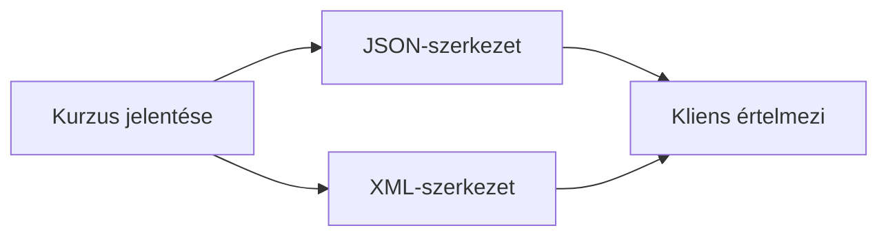

# 05.02. JSON, XML és strukturált adatok

A webes API-válasz nem attól hasznos, hogy szöveget tartalmaz, hanem attól, hogy a kliens következetesen értelmezni tudja. A JSON és az XML strukturált adat jelölésére alkalmas formátumok. Más szintaxist használnak, de ugyanazt a kérdést vetik fel: hogyan különítjük el az adat jelentését a megjelenésétől, és hogyan egyeznek meg a felek az elvárt szerkezetben?

## Szükséges előismeretek

- [Webes API](05-01-what-is-a-web-api.md) — a kliens és szolgáltatás közötti szerződés.
- [Fejlécek és tartalomtípusok](../02/02-05-headers-body-and-content-types.md) — a `Content-Type` szerepe.

## Ugyanaz a kurzusadat két formában

A kurzuslista oldal és a mobilalkalmazás ugyanazt a kurzust használja. A szerver visszaadhatja az adatot JSON-ként:

```json
{
  "id": 42,
  "cim": "Webprogramozás I",
  "elerheto": true,
  "temak": ["HTTP", "böngésző", "API"]
}
```

Az objektumban kulcs–érték párok vannak. Az `id` szám, a `cim` szöveg, az `elerheto` logikai érték, a `temak` pedig lista. A JSON-nak pontos szintaxisa van: a kulcsok idézőjelek között állnak, a szövegek is, és a különböző értéktípusok nem cserélhetők fel észrevétlenül. Ha az API-szerződés szerint az `id` szám, de váratlanul szövegként érkezik, a kliens programjának működése megváltozhat.

Ugyanez a tartalom XML-ben is ábrázolható:

```xml
<kurzus id="42" elerheto="true">
  <cim>Webprogramozás I</cim>
  <temak><tema>HTTP</tema><tema>böngésző</tema><tema>API</tema></temak>
</kurzus>
```

Az XML elemeket és attribútumokat használ, amelyek egymásba ágyazhatók. Itt az `elerheto` attribútum karakteres érték; a kliensnek az adatséma alapján kell értelmeznie logikai jelentését. Az XML nem „régi JSON”, hanem más modell és eszközkészlet. Vannak helyzetek, ahol dokumentumszerű szerkezetre, névterekre vagy már meglévő XML-alapú rendszerekkel való együttműködésre van szükség.



## Adat és dokumentum

Egy JSON-válasz tipikusan adatrekordokat, listákat és kapcsolatokat ír le, amelyeket a kliens tovább feldolgoz. A HTML ezzel szemben webes dokumentum: a tartalom szerkezetén kívül a böngésző megjelenítéséhez szükséges jelentést és hivatkozásokat is hordoz. Az XML mind adatcsere, mind dokumentumszerű tartalom jelölésére használható. A kategóriák nem kizárólagosak, de a felhasználási cél segít a megfelelő formátum kiválasztásában.

> [!note] Az adatformátum nem adatszerződés
> A `Content-Type: application/json` vagy `application/xml` fejléc megmutatja, hogyan értelmezhető a válasz törzse. A kliensnek azonban a konkrét mezők és jelentések ismeretére is szüksége van. A tartalomtípus nem API-dokumentáció: csak a reprezentáció formátumát jelzi.

## Hiányzó adat és változó szerkezet

Az adatformátum szerkezete önmagában nem mondja meg, egy mező kötelező-e. Ha a kurzus oktatója még nincs kijelölve, a szerződésnek tisztáznia kell, hogy a mező hiányzik, `null` értékű, vagy valamilyen más jelzést kap. A kliens nem következtethet a lehetséges állapotokra egyetlen sikeres mintaválaszból. Ugyanígy a lista sorrendjéről, a dátumok alakjáról és az azonosítók jelentéséről is meg kell állapodni.

A formátumválasztás tehát csak az első réteg. A valódi adatcsere szerződéses jelentésen alapul: ugyanazt a `cim` mezőt a felek ugyanúgy értelmezik, és tudják, mit kezdjenek a hiányzó vagy ismeretlen mezővel. A későbbi verziózásnál ez különösen fontossá válik.

## Gyakori félreértések

| Állítás | Pontosítás |
| --- | --- |
| „A JSON maga az API.” | A JSON adatformátum; az API a műveleteket és szerződést is meghatározza. |
| „A `Content-Type` minden mező jelentését leírja.” | Csak a törzs formátumát jelzi. |
| „Az XML és a HTML ugyanaz.” | Mindkettő jelölőnyelv, de más célú szabályokat és használatot követnek. |
| „Egy mintaválaszból minden lehetséges állapot kiderül.” | A hiányzó mezők és hibák külön dokumentációt igényelnek. |

## Megismert fogalmak

- **JSON:** Objektumokat, listákat és alapvető értéktípusokat szövegként leíró adatcsere-formátum.
- **XML:** Elemekből és attribútumokból felépülő, hierarchikus jelölőnyelv, amely adatot és dokumentumszerű tartalmat is leírhat.
- **Strukturált adat:** Meghatározott szerkezetű és jelentésű információ, amelyet a program mezők és típusok szerint dolgoz fel.
- **Reprezentáció:** Egy erőforrás vagy adat adott formátumú megjelenése a HTTP-válaszban.
- **Adatséma:** Az adatok alakját, típusait és megengedett kapcsolatait leíró szabályrendszer.
