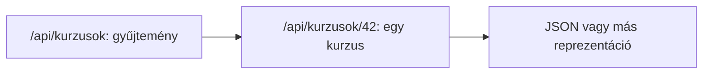

# 05.03. REST: erőforrások és HTTP-műveletek

A REST olyan architekturális megközelítés, amely a webes erőforrásokra és a HTTP szabályos használatára épít. Nem egyenlő azzal, hogy egy API JSON-t ad, és nem egyszerű URL-elnevezési divat. A kurzus példáján azt vizsgáljuk, hogyan kapcsolódik az erőforrás címe, a HTTP-metódus, a válasz és a kliens–szerver felelősség a REST szemléletéhez.

## Szükséges előismeretek

- [Webes API](05-01-what-is-a-web-api.md) — a kapcsolódási pont és szerződés.
- [HTTP-metódusok](../02/02-03-http-methods.md) és [státuszkódok](../02/02-04-http-status-codes.md) — a kérés szándéka és a válasz eredménye.
- [Webcímek és erőforrások](../02/02-01-web-addresses-and-resources.md) — az erőforrás azonosítása.

## Kurzusok mint erőforrások

Az egyetemi szolgáltatásban a kurzusgyűjtemény és egy konkrét kurzus külön erőforrás lehet. A `/api/kurzusok` a gyűjteményt, a `/api/kurzusok/42` a 42-es kurzust jelölheti. A konkrét URL-ek a szolgáltatás tervezési döntései; a lényeg, hogy az azonosítók a kliens számára követhető jelentéssel bírjanak.

Ugyanazt az erőforrást a szerver különböző reprezentációban is adhatja. A REST szemléletben a kliens a reprezentációval dolgozik, nem egy távoli adatbázistáblát nyit meg. A HTTP-fejlécek, státuszkódok és a válasz tartalma együtt hordozzák a művelet eredményét.

## A HTTP-metódusok jelentése

A `GET` erőforrás lekérésére szolgál, és nem kellene állapotváltoztató műveletet végrehajtania. A `POST` gyakran új erőforrás létrehozását vagy más, szerveroldali feldolgozást kezdeményez. A `PUT` egy célzott erőforrás teljes cseréjére, a `PATCH` részleges módosítására, a `DELETE` eltávolítására használható a szolgáltatás szerződése szerint. A metódusok ismert HTTP-szemantikája fontosabb a puszta elnevezésüknél.

| Kérés | Lehetséges cél | Tipikus eredmény |
| --- | --- | --- |
| `GET /api/kurzusok/42` | Kurzusadat lekérése | Reprezentáció vagy `404` |
| `POST /api/kurzusok` | Új kurzus létrehozása | Létrejött erőforrás jelzése |
| `PATCH /api/kurzusok/42` | Egy adat módosítása | Módosított eredmény vagy hiba |
| `DELETE /api/kurzusok/42` | Kurzus törlése | Siker vagy elutasítás |

A táblázat lehetséges szerződést mutat, nem az egyetem valódi API-ját. Nem minden felhasználó jogosult létrehozásra vagy törlésre. A metódus és a jogosultság külön kérdés, ahogyan a kérés technikai helyessége és az üzleti szabályok teljesülése is.

## Állapotmentesség és válaszok

A REST egyik fontos korlátja az állapotmentes kliens–szerver kommunikáció: egy kérés önmagában hordozza az értelmezéséhez szükséges információt, és a szerver nem támaszkodik arra, hogy a kliens előző kérésének alkalmazásszintű beszélgetésállapota ott maradt. Ez nem tiltja, hogy a szerver adatot tároljon, és nem azt jelenti, hogy a felhasználónak ne lehetne bejelentkezése. Az állapot és identitás részletei későbbi alkalom témái.

A HTTP-válasz eredményét státuszkód jelzi. Egy nem létező kurzusnál például a `404`, egy sikeres létrehozásnál a `201` értelmes lehet. A hibákhoz is következetes válaszformát érdemes adni, hogy a kliens ne csak egy számot, hanem feldolgozható okot kapjon. A gyorsítótárazhatóság és más HTTP-szabályok kihasználása szintén a webes erőforrásmodell előnye lehet.

## Mi nem következik a REST-ből?

> [!note] A JSON önmagában nem teszi REST-szerűvé az API-t
> Az, hogy egy végpont neve főnév, vagy hogy a válasz JSON, önmagában nem tesz egy rendszert REST-szerűvé. A REST több architekturális korlát együttese; itt a fontos elemeket emeljük ki, nem teljes megfelelőségi vizsgálatot végzünk. A kliens és szerver közötti világos felelősség, az azonosítható erőforrás, a reprezentáció és a HTTP jelentésének következetes használata együtt adja a szemlélet lényegét.

Más API-stílus is lehet indokolt. Ha a kliens sokféle összekapcsolt adatból akar pontos mezőket választani, vagy inkább névvel jelölt távoli műveleteket hív, a következő fejezet eltérő megközelítéseket mutat be.

## Gyakori félreértések

| Állítás | Pontosítás |
| --- | --- |
| „REST = JSON.” | A JSON csak lehetséges reprezentáció. |
| „Minden POST létrehozás.” | A konkrét szerződés más feldolgozást is rendelhet hozzá. |
| „Állapotmentes = a szerver nem tárol adatot.” | A kérések közötti beszélgetésállapotról szól, nem az adatbázis hiányáról. |
| „Főnévi URL-től minden API REST lesz.” | A HTTP-szemantika és a további architekturális korlátok is számítanak. |

## Megismert fogalmak

- **REST:** Erőforrásokra, reprezentációkra és meghatározott kliens–szerver korlátokra épülő architekturális stílus.
- **Erőforrás-azonosító:** Az erőforrást megnevező webes cím, amelyhez különböző HTTP-műveletek kapcsolódhatnak.
- **Állapotmentes kérés:** Olyan kérés, amely az értelmezéséhez szükséges információt maga hordozza, előző alkalmazásszintű beszélgetésállapot nélkül.
- **Reprezentáció:** Az erőforrásnak a kliens számára átadott formája, például JSON-válasz.
