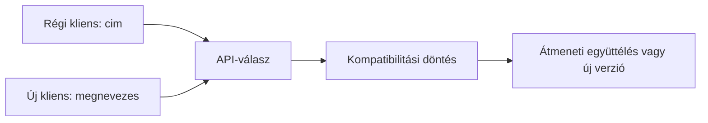
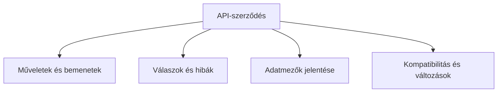

# 05.06. API-verziózás, kompatibilitás és dokumentáció

Az API több kliens számára jelenthet hosszú távú szerződést. Ha a szolgáltatás változik, a régi böngészős vagy mobilalkalmazás nem feltétlenül frissül ugyanabban a pillanatban. A verziózás, kompatibilitás és dokumentáció feladata, hogy a változás követhető és a kliensek számára kezelhető legyen.

## Szükséges előismeretek

- [API-szerződés](05-01-what-is-a-web-api.md) — kérések, válaszok és hibák megállapodása.
- [JSON és XML](05-02-json-xml-and-data.md) — az adatok szerkezetének jelentősége.
- [REST, GraphQL és RPC](05-04-graphql-and-rpc.md) — különböző API-szemléletek.

## Egy mező változása több kliensnél

A kurzus API-ja eddig `cim` nevű mezőt küldött. Az új szerververzió fejlesztője átnevezné `megnevezes`-re. A frissített webes felület az új mezőt olvasná, de egy régebbi mobilalkalmazás továbbra is a `cim` mezőt várja. Ha a szerver egyik napról a másikra csak az új nevet küldi, a régi kliens nem tudja megjeleníteni a kurzust. A hálózat és a HTTP ugyan működik, az API-szerződés mégis megsérült.

## Kompatibilis és törő változás

Egy új, opcionális válaszmezőt a régi kliens sok esetben figyelmen kívül hagyhat. Ez gyakran visszafelé kompatibilis bővítés, ha a korábbi mezők jelentése és típusa változatlan marad. Egy kötelező mező eltávolítása, típusának megváltoztatása vagy jelentésének átírása viszont könnyen törő változás. Az, hogy egy módosítás valóban kompatibilis-e, a tényleges szerződéstől és a kliensek viselkedésétől függ.

A hibaválaszok is a szerződés részei. Ha a kliens eddig adott státuszkódra és hibaformátumra számított, a változás ott is törheti a működést. A „csak dokumentációs” módosítás általában más természetű, de ha az eddigi dokumentáció hibás volt és a kliensek erre építettek, a helyzetet gondosan kell kezelni.

## Verziózási lehetőségek

Az API új verzióját több módon lehet megkülönböztetni: megjelenhet például az URL útvonalában, kérésfejlécben vagy a szolgáltatás sémájában. Nincs minden szolgáltatásra egyetlen kötelező forma. A cél az, hogy a kliens tudja, melyik szerződést használja, és legyen átmenet, ha a régi verziót később kivezetik.

> [!tip] A verziószám mellett változáskezelés is kell
> A verziószám önmagában nem pótolja a változások kezelését. Ha minden apró bővítés új verziót kap, a kliensek fölöslegesen sok változást követnek. Ha viszont törő módosítás történik jelzés nélkül, a régi kliensek meglepetésszerűen hibáznak. A verziózás, az átmeneti együttélés és a világos kivezetési tájékoztatás együtt segítenek.

## Mit tartalmazzon a dokumentáció?

Egy használható API-leírás megmondja, mire való a szolgáltatás, hol érhetők el a műveletek, milyen metódus és bemenet kell, mely mezők kötelezők vagy opcionálisak, milyen sikeres és hibás válasz várható, és hogyan változott a szerződés. A példák segítenek, de nem helyettesítik a szabályok leírását. Egyetlen mintaválasz nem mondja meg, mi történik hiányzó adatoknál vagy jogosultsági hibánál.

Az OpenAPI egy géppel és emberrel is feldolgozható szabványos leírási forma HTTP API-khoz. Segíthet a végpontok, paraméterek és válaszok következetes rögzítésében, de a jó dokumentáció nem pusztán egy fájlformátum eredménye: a mezők pontos jelentése és a felhasználási feltételek is kellenek. GraphQL esetén a séma és mezőleírások hasonlóan fontos kapcsolódási pontot adnak.

## A szerződés próbája

A szolgáltató és a kliens együttműködését érdemes a régi és új kliens szemszögéből is ellenőrizni. Megkapja-e a régi kliens a számára szükséges mezőket? Érthetően reagál-e a hiányzó erőforrásra? Nem változott-e meg egy mező jelentése a neve megtartása mellett? Az ilyen kérdések a kompatibilitást konkrétan vizsgálják, nem csak egy verziószám jelenlétét.

## Gyakori félreértések

| Állítás | Pontosítás |
| --- | --- |
| „Új szerververziónál minden kliens egyszerre frissül.” | A kliensek eltérő ütemben változhatnak. |
| „Új mező mindig törő változás.” | Opcionális bővítés sok esetben kezelhető a régi kliensek számára. |
| „A verziószám önmagában megőrzi a kompatibilitást.” | A régi szerződés tényleges fenntartása és az átmenet is számít. |
| „Egy mintaválasz teljes dokumentáció.” | A hibák, feltételek és mezőjelentések külön leírást igényelnek. |

## Megismert fogalmak

- **Visszafelé kompatibilitás:** Az új API-változat olyan tulajdonsága, amely mellett a korábbi szerződésre épülő kliensek tovább működhetnek.
- **Törő változás:** Olyan módosítás, amely a korábbi szerződést használó kliensek működését megsértheti.
- **API-verzió:** A szolgáltatás szerződésének megkülönböztetett változata, amelyhez kliens és szolgáltató ugyanazt az elvárást társítja.
- **API-dokumentáció:** A műveletek, adatok, hibák és változások követhető leírása a kliensek készítői számára.
- **OpenAPI:** HTTP API-k képességeinek szabványos, géppel is feldolgozható leírási formája.
