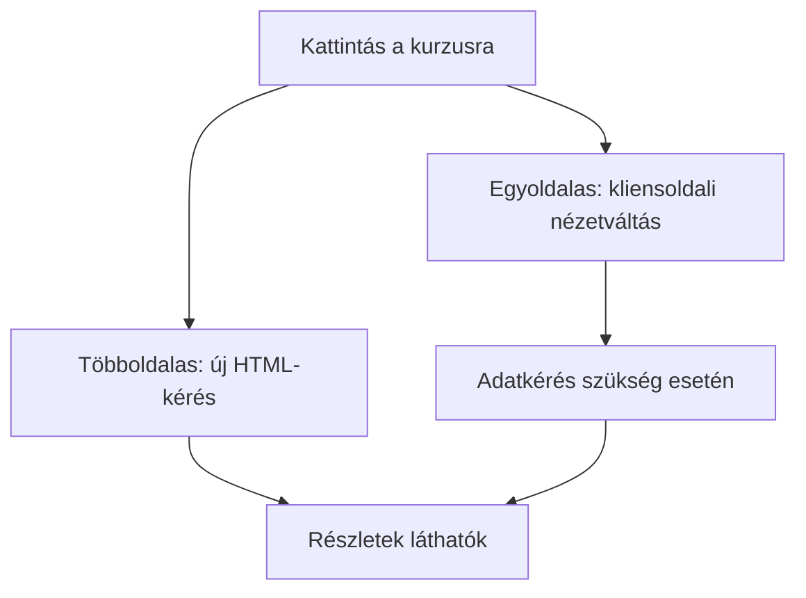

# 06.01. Többoldalas és egyoldalas webalkalmazások

Két webes felület hasonlóan nézhet ki, miközben navigációjuk eltérően működik. Többoldalas alkalmazásnál az oldalak közötti váltás rendszerint új dokumentumkérést indít. Egyoldalas alkalmazásnál a már betöltött alkalmazás gyakran adatot kér, majd a böngészőben alakítja át a felületet. A különbség a felhasználói út, a szerver és a kliens feladataiban jelenik meg.

## Szükséges előismeretek

- [Böngésző és webes dokumentum](../03/03-03-browser-rendering.md) — HTML, DOM és megjelenítés.
- [Webes API](../05/05-01-what-is-a-web-api.md) — programok közötti adatcsere.

## Egy kurzuskatalógus két változata

A hallgató megnyit egy kurzuslistát, majd egy kurzus részleteire kattint. Többoldalas változatban a böngésző a részletek címére navigál, és új HTML-dokumentumot kap. Egyoldalas változatban az alkalmazás JavaScriptje kezelheti a kattintást, adatot kérhet az API-tól, és a jelenlegi dokumentumban cserélheti ki a látható nézetet. Mindkét változatnál létezhet egyedi URL a kurzushoz, és mindkettő lehet interaktív.

Az ábra tipikus működést mutat, nem merev technológiai szabályt. Többoldalas oldalon is lehet JavaScriptes frissítés, és egyoldalas alkalmazás is kérhet a szervertől teljes dokumentumot első megnyitáskor.

## Többoldalas alkalmazás

**MPA** esetén a különböző oldalakhoz többnyire külön dokumentumválasz tartozik. A szerver minden navigációhoz készíthet HTML-t, vagy statikus fájlt is szolgálhat ki. A böngésző ismert hivatkozás- és előzménykezelése természetes módon működik. Az új dokumentum betöltése azonban hálózati és renderelési munkával járhat. A teljes oldal újratöltése nem automatikusan lassú: a gyorsítótár, a szerver és az oldal mérete is számít.

Egy hírportál vagy egyszerű kurzuskatalógus jól működhet többoldalas modellben. A címezhető tartalom és az önálló HTML-dokumentum külön előny lehet. A modell nem jelenti, hogy minden művelet után teljes újratöltés szükséges: egy űrlap részleges ellenőrzése vagy egy szűrő itt is működhet JavaScript segítségével.

## Egyoldalas alkalmazás

**SPA** esetén a kezdeti betöltés után a JavaScript veszi át a nézetváltások jelentős részét. A kliens API-n keresztül adatot kérhet, majd módosítja a DOM-ot. A váltás gyorsnak és folyamatosnak érződhet, de az első betöltéshez és a program futásához több kliensoldali munka kellhet. A hibás vagy lassú JavaScript a tartalom elérését is akadályozhatja, ha minden nézet ettől függ.

> [!tip] Működjenek a mély linkek és a böngészőelőzmények
> Az SPA-nak külön kell figyelnie az URL-ekre, a Vissza gombra, az állapot visszaállítására és a közvetlenül megnyitott mély linkekre. Ha a felhasználó kimásolja egy kurzus részleteinek címét, annak másik eszközön vagy frissítés után is értelmes nézetre kell vezetnie. A böngésző History API-ja segíthet ebben, de az URL frissítése önmagában nem tölti be a megfelelő adatot.

## Nem azonos a renderelési stratégiával

Az MPA–SPA különbség elsősorban a navigáció és az alkalmazás felépítésének kérdése. A kliensoldali, szerveroldali és statikus renderelés azt írja le, hol és mikor áll elő a HTML vagy a látható nézet. Ezek kombinálhatók: egy többoldalas webhely oldalai lehetnek előre előállított HTML-ek, egy SPA első oldala pedig érkezhet szerveroldali HTML-lel. A két tengely összekeverése gyakori tévhit.

## Gyakori félreértések

| Állítás | Pontosítás |
| --- | --- |
| „Az MPA nem lehet interaktív.” | Egy többoldalas oldal is használhat JavaScriptet és API-kat. |
| „Az SPA minden kattintáskor új HTML-dokumentumot kér.” | Gyakran a meglévő dokumentumban vált nézetet. |
| „Az SPA mindig gyorsabb.” | Az első betöltés, programfutás és hálózati adatkérés is számít. |
| „Az MPA vagy SPA automatikusan meghatározza a renderelést.” | A navigációs modell és a renderelési stratégia külön döntés. |

## Megismert fogalmak

- **Többoldalas alkalmazás (MPA):** Olyan webalkalmazási modell, amelyben a különböző nézetekhez jellemzően külön HTML-dokumentumok tartoznak.
- **Egyoldalas alkalmazás (SPA):** Olyan modell, amelyben a már betöltött kliensalkalmazás gyakran a jelenlegi dokumentumon belül vált nézetet és kér új adatot.
- **Kliensoldali navigáció:** Nézetváltás, amelyet a böngészőben futó program kezel új teljes dokumentum betöltése nélkül.
- **Mély link:** Egy alkalmazás konkrét belső nézetét közvetlenül megnyitó URL.
