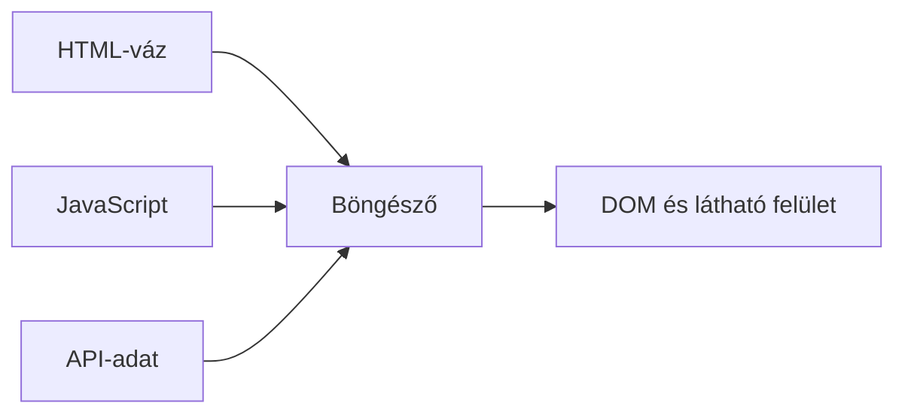

# 06.02. Kliensoldali renderelés

Kliensoldali renderelésnél a böngészőben futó JavaScript állítja össze a felület jelentős részét. A szerver HTML-vázat, programot és adatot adhat; a kliens ezekből építi fel az aktuális DOM-ot. Ez rugalmas interakciót adhat, de a használható tartalom megjelenése a program betöltésétől és futásától is függhet.

## Szükséges előismeretek

- [HTML, CSS, JavaScript és DOM](../03/03-02-document-structure-and-dom.md) — a dokumentum böngészős modellje.
- [Webes API és adatok](../05/05-01-what-is-a-web-api.md) — honnan kaphat adatot a kliensprogram.

## A kurzuslista összeáll a böngészőben

A hallgató megnyit egy kurzuskeresőt. A szerver egy kezdeti HTML-vázat és JavaScriptet küld. A program lekéri az aktuális kurzusokat, majd létrehozza a listához szükséges DOM-elemeket. Ha a felhasználó szűrőt állít, ugyanaz a program újraszámolhatja a megjelenő elemeket. A szerver nem feltétlenül küld minden nézetváltáshoz teljes új HTML-oldalt.

Az ábra nem állítja, hogy kliensoldali rendereléskor a szerver soha nem küld HTML-t. A kiinduló váz és egyéb tartalom is lehet HTML; a döntő kérdés az, hol készül el a fő tartalmi nézet.

## A betöltési lánc következményei

A böngészőnek előbb le kell töltenie és futtatnia a szükséges programot. Ha a tartalomhoz API-adat kell, annak válaszára is várhat. Az első használható képernyő idejét így a HTML mellett a JavaScript mérete, futása és az adatlekérés befolyásolja. Gyenge eszközön a feldolgozás különösen számíthat. Nem elég a hálózati kérések számát nézni; a böngészőben végzett munka is a felhasználói élmény része.

A felület betöltési, üres és hibás állapotait külön kell megtervezni. Ha az API nem érhető el, a program ne hagyjon végtelenül forgó jelzést vagy magyarázat nélküli üres területet. Ha nincs találat, az nem ugyanaz, mint az adatkérés hibája. A kliensoldali renderelés nem csak DOM-módosítás, hanem állapotokhoz tartozó érthető felület.

## Interakció és újrarajzolás

A kliensprogram gyorsan reagálhat helyi változásokra, például a kurzusok szűrésére vagy egy panel kinyitására. Ha a változáshoz szerveradat kell, új HTTP-kérést indít. A DOM módosítása után a böngésző stílust és elrendezést is újraszámolhat. A felhasználó által érzett sebesség tehát a program tervezésétől, a hálózattól és a rendereléstől együtt függ.

Az alkalmazás adatmodellje és a megjelenő DOM nem azonos. A kurzuslista adatai lehetnek memóriában, miközben a képernyőn csak a szűrt részük látszik. Ha az adat frissül, a programnak össze kell hangolnia a belső állapotot és a felületet. Ezt a navigáció és kliensoldali állapot fejezete tovább részletezi.

## Kapcsolat az SPA-val

> [!note] Az SPA és a CSR eltérő fogalom
> Sok SPA erősen támaszkodik kliensoldali renderelésre, de a két fogalom nem azonos. SPA-ban a navigáció jelentős részét a kliens kezeli; a kezdeti oldal akár szerveroldalon előállított HTML-ként is érkezhet. Egy többoldalas webhely egyetlen interaktív részét szintén renderelheti JavaScript. A renderelés helyét és a navigáció módját külön kell megnevezni.

## Gyakori félreértések

| Állítás | Pontosítás |
| --- | --- |
| „CSR esetén nincs szerver.” | A szerver HTML-vázat, programot és API-adatot is adhat. |
| „A JavaScript letöltése után az oldal kész.” | Futtatás, adatlekérés és renderelés még hátra lehet. |
| „A kliensoldali váltás mindig hálózatmentes.” | Friss adathoz új API-kérés kellhet. |
| „CSR = SPA.” | A renderelés helye és a navigációs modell eltérő tengely. |

## Megismert fogalmak

- **Kliensoldali renderelés (CSR):** A felület jelentős részének böngészőben, JavaScript segítségével történő előállítása.
- **HTML-váz:** Kezdeti dokumentum, amely a kliensoldali alkalmazás számára kiinduló szerkezetet ad.
- **Betöltési állapot:** A felület olyan állapota, amelyben a szükséges program vagy adat még nem áll rendelkezésre.
- **Kliensoldali adatmodell:** A böngészőben kezelt adatok és állapot, amelyek alapján a program megjeleníti a felületet.
