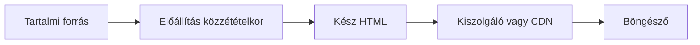

# 06.04. Statikus előállítás és hibrid renderelés

Nem minden oldalt kell minden kéréskor újra összerakni. Statikus előállításkor a HTML a közzététel előtt készül el, és később fájlként szolgálható ki. Ez jól illik ritkán változó, sokaknak azonos tartalomhoz. Más oldalak friss vagy személyre szabott adatot igényelnek; egy alkalmazás ezért eltérő renderelési módszereket is kombinálhat.

## Szükséges előismeretek

- [Kliensoldali renderelés](06-02-client-side-rendering.md) — a böngészőben felépülő nézet.
- [Szerveroldali renderelés](06-03-server-side-rendering.md) — kéréskor előállított HTML.

## Kurzusleírás a közzététel előtt

Az egyetem közzéteszi a következő félév hivatalos kurzusleírásait. Ha ezek a szövegek ritkán változnak és minden olvasónak ugyanazok, a HTML előre létrehozható. A közzétételi folyamat a forrásból elkészíti az oldalakat, a kiszolgáló vagy CDN pedig a kész HTML-t továbbítja. Ezt statikus oldalgenerálásnak, gyakran SSG-nek nevezik.

> [!note] A statikus HTML is lehet interaktív
> Az „előre kész” nem jelenti, hogy az oldal interaktivitás nélküli. A HTML-hez CSS és JavaScript is kapcsolható. A döntő különbség az, hogy a kezdeti HTML fő tartalma nem a felhasználó minden kérésére külön keletkezik.

## Sebesség és frissesség

A kész HTML gyorsan kiszolgálható, és sok esetben egyszerűen gyorsítótárazható. Ez előny lehet dokumentációhoz, hírek archívumához vagy ritkán módosuló kurzusleíráshoz. A hátrány a frissesség kezelése: ha megváltozik az órarend vagy a kurzus leírása, újra elő kell állítani és közzé kell tenni az érintett oldalt. A közzétételi folyamat hibája régi információt hagyhat kint.

Az élő férőhelyszámot nem jó a félév elején egyszer előállított HTML-ben változatlan igazságként kezelni. Megoldás lehet, hogy a statikus oldal a leírást tartalmazza, a friss férőhelyszámot pedig a böngésző külön API-kérésből szerzi meg. Ez már hibrid felépítés: a különböző tartalmak frissességi igénye eltérő.

## Három hely a tartalom előállítására

Ugyanaz a kurzusnézet készülhet közzétételkor, szerveroldalon egy konkrét kéréskor, vagy a böngészőben. A választás nem pusztán „melyik gyorsabb?” kérdés. A statikus oldal első válasza gyors lehet, de az új tartalom közzététele külön lépés. Az SSR friss, személyre szabott HTML-t adhat, de szervermunkát igényel. A CSR lehetővé teszi a böngészőben történő dinamikus felépítést, de program- és adatbetöltést kívánhat.

| Stratégia | Mikor áll elő a fő nézet? | Mire figyelünk? |
| --- | --- | --- |
| SSG | Közzététel előtt | Frissítés és újragenerálás |
| SSR | A kérés kiszolgálásakor | Szervermunka és válaszidő |
| CSR | A böngészőben | JavaScript és adatbetöltés |

A táblázat egyszerűsített. Valós alkalmazásokban a három módszer keverhető. Egy statikus dokumentációban lehet kliensoldali kereső, egy SSR-oldal interaktív része kliensoldalon működhet, egy SPA pedig kaphat kezdeti szerveroldali HTML-t.

## Hibrid megoldások és hidratálás

Hibrid megoldásnál az egyes oldalak vagy oldalelemek külön stratégiát követnek. A kurzusleírás lehet előre előállított, a jelentkezési státusz kéréskor vagy API-ból frissülhet, a keresőmező pedig kliensoldalon szűrhet. Ha az előre vagy szerveroldalon készült HTML-re a JavaScript átveszi az interaktív vezérlést, hidratálás történhet. A legfontosabb, hogy ne küldjünk és futtassunk több programot, mint amennyi az adott feladat használhatóságához szükséges.

## Gyakori félreértések

| Állítás | Pontosítás |
| --- | --- |
| „Statikus oldal soha nem változik.” | Új közzétételkor frissülhet, és kliensoldali adatot is kérhet. |
| „SSG = JavaScript nélküli oldal.” | Interaktív program is kapcsolható a kész HTML-hez. |
| „Egy alkalmazásnak egyetlen renderelési stratégiát kell választania.” | Oldalak és elemek eltérő igényeket követhetnek. |
| „Az első gyors HTML garantálja a gyors interakciót.” | A későbbi programmunka és adatkérés is számít. |

## Megismert fogalmak

- **Statikus oldalgenerálás (SSG):** A HTML közzététel előtti előállítása és kész dokumentumként történő kiszolgálása.
- **Hibrid renderelés:** Több renderelési stratégia együttes alkalmazása eltérő oldalakhoz vagy oldalelemekhez.
- **Közzétételi folyamat:** A tartalmi forrásból a kiszolgálható statikus állományokat létrehozó és kiadó lépések sora.
