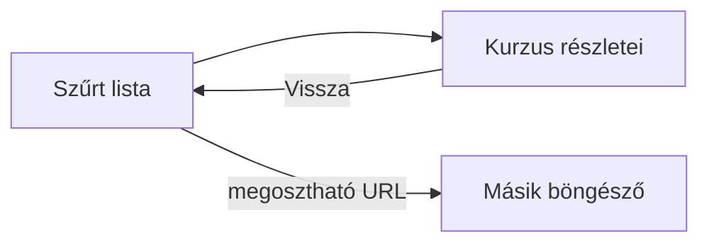
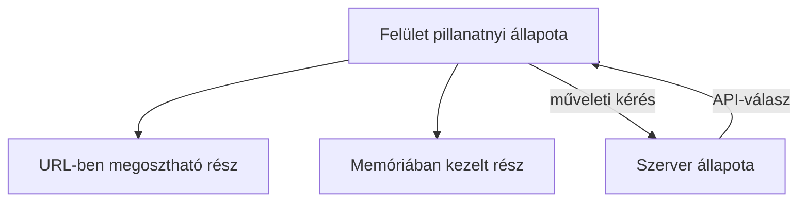

# 06.05. Navigáció, interaktivitás és kliensoldali állapot

Egy webalkalmazás nemcsak oldalakat jelenít meg: a felhasználó útját és a felület pillanatnyi állapotát is kezeli. A kurzuskeresőben a szűrő, a kiválasztott kurzus és a nyitott részletek egy része a böngészőben élhet. Ezek nem ugyanazok, mint a szerver által kezelt hivatalos jelentkezési adatok. A navigáció és az állapot különválasztása segít abban, hogy a Vissza gomb, a frissítés és a közvetlen URL is értelmesen működjön.

## Szükséges előismeretek

- [Többoldalas és egyoldalas alkalmazások](06-01-multi-page-and-single-page-apps.md) — nézetváltás új dokumentummal vagy a kliensben.
- [Kliensoldali renderelés](06-02-client-side-rendering.md) — a DOM és a programállapot kapcsolata.
- [Webes API](../05/05-01-what-is-a-web-api.md) — a szerveren tárolt adat lekérése.

## A hallgató keres, kiválaszt, visszalép

A hallgató a kurzuslistában rákeres a „web” szóra, kiválaszt egy kurzust, majd a Vissza gombbal visszatérne a szűrt listához. Ha a program csak a képernyőn látható elemeket cseréli, de az URL-t és az előzményeket figyelmen kívül hagyja, a Vissza gomb váratlan helyre viheti. Ha az oldal frissítésekor elveszik a keresés, a hallgató munkája is megszakad. Ezek nem pusztán grafikai hibák, hanem navigációs és állapotkezelési döntések.

## Mi legyen az URL-ben?

Az URL jól használható a megosztható, újranyitható állapot jelölésére. A kiválasztott kurzus azonosítója természetesen szerepelhet az útvonalban, egy keresési kifejezés vagy szűrő a lekérdezési részben. Így a hallgató kimásolhatja a címet, frissítheti a lapot, és később visszatérhet ugyanarra a nézetre. Nem minden pillanatnyi felületi részlet való az URL-be: például egy éppen nyitott, lényegtelen súgópanel állapota maradhat helyi programállapot.

> [!note] Az URL megváltoztatása csak a navigáció egyik része
> Egyoldalas alkalmazásban a History API segíthet az URL és a böngésző előzményeinek kezelésében. Az URL módosítása azonban nem tölti be automatikusan a hozzá tartozó adatot és nem rajzolja ki a nézetet; az alkalmazásnak ezt is meg kell oldania. A közvetlenül megnyitott belső cím szerveroldali kiszolgálásáról is gondoskodni kell, különben egy SPA belső linkje frissítéskor hibázhat.

## Helyi és szerveroldali állapot

A böngésző pillanatnyi állapota lehet például a keresőmező értéke, a kiválasztott fül vagy a folyamatban lévő adatbetöltés. A szerveroldali állapot lehet a kurzus tényleges férőhelyszáma vagy egy beadott jelentkezés. A kliens megjeleníthet másolatot vagy pillanatnyi becslést a szerver adatairól, de nem tekintheti azt automatikusan hivatalos igazságnak. Jelentkezéskor a szervernek újra döntenie kell a saját szabályai szerint.

Az előző alkalom IndexedDB-fejezetéből tudjuk, hogy bizonyos helyi adat a böngészőben későbbre is tárolható. Ez nem jelenti, hogy minden felületi állapotot adatbázisba kell írni. A tárolás helyét a frissesség, megoszthatóság és elvesztés következménye alapján érdemes választani.

## Interakció és hozzáférhetőség

Egy kliensoldali nézetváltás ne csak vizuálisan történjen meg. A felhasználónak értenie kell, melyik nézetbe jutott, mi töltődik, és mi történt hiba esetén. A natív hivatkozások és gombok jelentése itt is fontos. Ha a JavaScript a tartalmat frissíti, a fókusz és a navigáció követhetősége is feladat lehet. A részletes hozzáférhetőségi gyakorlat későbbi alkalom témája, de a szemantikus HTML már most jó alap.

## Gyakori félreértések

| Állítás | Pontosítás |
| --- | --- |
| „A látható nézet elég, az URL mellékes.” | Megosztás, frissítés és előzmények miatt az URL fontos állapotot jelölhet. |
| „A kliensoldali állapot azonos a szerver hivatalos adatával.” | A kliens pillanatnyi másolatot vagy felületi állapotot is kezelhet. |
| „A History API automatikusan kirajzolja az oldalt.” | Az alkalmazásnak kell az URL-hez tartozó nézetet felépítenie. |
| „Minden állapotot IndexedDB-be kell menteni.” | Az állapot megőrzési és megosztási igénye eltérő. |

## Megismert fogalmak

- **Kliensoldali állapot:** A böngészőben kezelt pillanatnyi adat, amely meghatározhatja a megjelenő nézetet és interakciót.
- **Szerveroldali állapot:** A szolgáltatás által kezelt, több kérés vagy felhasználó számára jelentős alkalmazási adat.
- **Navigációs állapot:** Az a rész, amely meghatározza, melyik nézet és URL aktuális a böngészőben.
- **History API:** Böngészőfelület a munkamenet előzményeinek programozott kezelésére, például kliensoldali navigáció támogatására.
