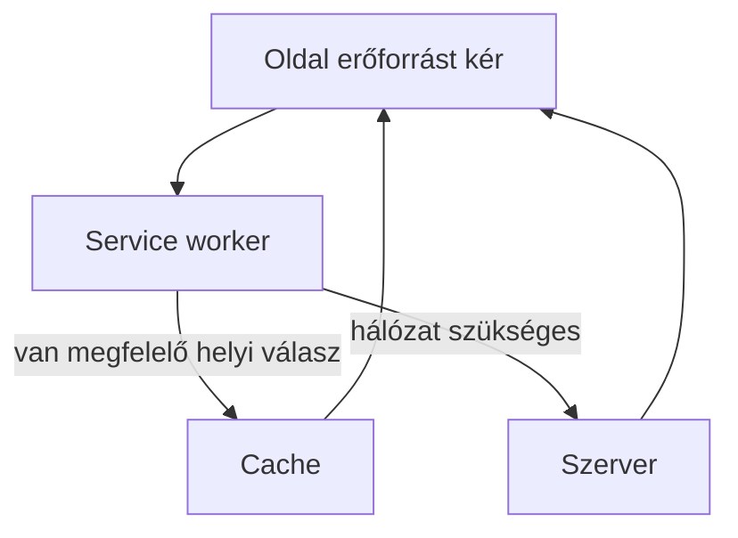

# 06.06. Service worker és offline működés

A webalkalmazás néha megszakadó hálózaton is hasznos lehet. A böngésző service worker nevű háttérkomponenst futtathat, amely a hozzá tartozó oldalak egyes hálózati kéréseit kezelheti, és megfelelően előkészített erőforrásokat helyi gyorsítótárból szolgálhat ki. Ez lehetővé tehet offline olvasást vagy bizonyos műveleteket, de nem tesz minden webes szolgáltatást automatikusan hálózat nélkülivé.

## Szükséges előismeretek

- [Webes erőforrások betöltése](../03/03-04-loading-web-resources.md) — a HTML, CSS, képek és programfájlok külön kérései.
- [Böngészőképességek és IndexedDB](../03/03-06-browser-capabilities.md) — helyi tárolás szerepe.
- [Kliensoldali állapot](06-05-navigation-and-client-state.md) — helyi és szerveroldali adat különbsége.

## A kurzusanyag útközben

Egy hallgató vonaton megnyitná a korábban látott kurzusleírást, de a kapcsolat megszakad. Ha az alkalmazás előre eltárolta a szükséges HTML-t, stílust és más erőforrásokat, a service worker bizonyos kérésekre ezekből válaszolhat. A hallgató így olvashatja a korábban elérhetővé tett anyagot. A friss férőhelyszámot vagy új jelentkezést viszont hálózat és szerveroldali döntés nélkül nem lehet megbízhatóan véglegesnek tekinteni.

Az ábra az ellenőrzött oldalak lehetséges működését mutatja. A service worker nem minden oldal minden kérését irányítja, és a tényleges útvonalat az alkalmazás gyorsítótárazási stratégiája határozza meg.

## Mi a service worker?

A service worker a weboldal fő JavaScriptjétől elkülönülő háttérben működő program. A hozzá tartozó hatókörön belül hálózati kérésekhez kapcsolódó eseményeket fogadhat, és válaszolhat a gyorsítótárból vagy a hálózat felől. Nincs közvetlen hozzáférése a DOM-hoz; a látható felületet továbbra is az oldal kezeli. A böngésző szükség szerint elindíthatja vagy leállíthatja a service workert, ezért nem szabad állandóan futó folyamatként elképzelni.

A service worker használata jellemzően biztonságos környezetet igényel, általában HTTPS-t; helyi fejlesztésnél a `localhost` speciális eset lehet. Telepítése, aktiválása és frissítése külön életciklus. Ez azért lényeges, mert egy új alkalmazásverzió és a régi gyorsítótári tartalom együtt könnyen hibát okozhat, ha nincs következetes frissítési terv.

## Cache, helyi adat és offline művelet

A Cache API webes kérésekhez tartozó válaszokat tárolhat. Az IndexedDB ezzel szemben strukturált alkalmazási adatot kezelhet, például egy félbehagyott jegyzetet. A két tároló más célra való. Egy offline olvasható kurzusanyaghoz a dokumentum és erőforrásai cache-elése lehet fontos; egy helyben szerkesztett beadandó vázlatához strukturált tárolás is szükséges lehet. Az offline végzett módosítás szerverre továbbítása külön szinkronizálási probléma.

> [!warning] Pontosan határozd meg, mi működik offline
> Nem minden adat cache-elhető gondolkodás nélkül. A személyes vagy gyorsan változó jelentkezési állapotnál frissességi, jogosultsági és adatvédelmi szempontok vannak. A service worker rossz stratégiával régi adatot mutathat akkor is, amikor van hálózat. A „működik offline” állításnál ezért pontosan meg kell nevezni, mely tartalom olvasható és mely művelet végezhető el.

## Nem azonos az SPA-val

Service worker többoldalas és egyoldalas webhelyhez is kapcsolható. Az SPA a navigáció és felület modellje; a service worker a kérések és háttérfeladatok egyik böngészős eszköze. Egy SPA nem működik automatikusan offline, és egy MPA is kínálhat offline olvasható oldalakat. A két fogalom külön tengelyen helyezkedik el.

## Gyakori félreértések

| Állítás | Pontosítás |
| --- | --- |
| „A service worker a felületet rajzolja.” | Nincs közvetlen DOM-hozzáférése; a kérések és háttérműveletek kezelésében segít. |
| „Az offline alkalmazás minden adata friss.” | A helyi másolat a legutóbbi ismert állapotot tükrözheti. |
| „Az SPA alapból offline működik.” | Külön tárolási és kéréskezelési terv kell. |
| „A Cache API és az IndexedDB ugyanaz.” | Az előbbi válaszokat, az utóbbi strukturált adatot kezel más módon. |

## Megismert fogalmak

- **Service worker:** Elkülönülő böngészős háttérprogram, amely a saját hatókörében többek között hálózati kérésekhez kapcsolódó eseményeket kezelhet.
- **Cache API:** Kérés–válasz párok helyi tárolására szolgáló böngészős felület.
- **Offline stratégia:** Annak tervezett szabálya, mely erőforrás és művelet használható hálózat nélkül, és hogyan történik a későbbi frissítés.
- **Hatókör:** Azon oldalak és erőforrások köre, amelyekre egy service worker vezérlése kiterjedhet.
