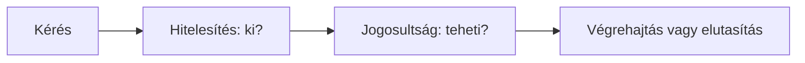

# 07.04. Hitelesítés és jogosultságkezelés

A bejelentkezett felhasználó felismerése és egy művelet engedélyezése két külön kérdés. A hitelesítés arra válaszol, kinek az identitását fogadja el a szolgáltatás. A jogosultságkezelés arra, hogy ez a szereplő mit tehet egy adott erőforrással. A kettő összekapcsolódik, de a „be van jelentkezve” állapot önmagában nem jogosít fel minden kurzus módosítására.

## Szükséges előismeretek

- [Cookie, munkamenet és token](07-03-browser-storage-and-tokens.md) — kérések és hozzáférési értékek összekötése.
- [Webes API-szerződés](../05/05-01-what-is-a-web-api.md) — műveletek és hibák.

## Hallgató és oktató ugyanazon rendszerben

A hallgató megnézheti a kurzusokat és jelentkezhet. Az oktató módosíthatja a saját kurzusa leírását. A két felhasználó egyaránt sikeresen hitelesítheti magát, de eltérő műveletekre jogosult. Ráadásul az oktató sem feltétlenül módosíthat minden kurzust: a konkrét erőforrás és a kapcsolat is számít.

Az ábra két logikai ellenőrzést választ el. A sorrend a rendszer belső megvalósításában összetettebb lehet, de a döntési kérdések különböznek. A szervernek nem szabad a böngészőben elrejtett gombból következtetnie arra, hogy egy művelet tiltott: az API-hívást is ellenőriznie kell.

## Hitelesítés: kinek hisszük a kérést?

A felhasználó többféle módon igazolhatja magát. A jelszavas belépés egy példa, de külső identitásszolgáltató vagy más megoldás is lehetséges. A sikeres hitelesítés után a szolgáltatás munkamenetet alakíthat ki, hogy a későbbi kéréseknél ne kelljen minden alkalommal újra megadni a teljes igazolást. A munkamenet azonosítója vagy megfelelő token segíthet a későbbi kérést a korábban felismert identitáshoz kötni.

A hitelesítés nem azt jelenti, hogy a szolgáltatás tévedhetetlenül tud mindent a személyről. Azt jelenti, hogy a kiválasztott módszer szerint elfogad egy identitásra vonatkozó állítást. A többfaktoros módszerek és a jelszóbiztonság részleteit a következő, biztonsági alkalom tárgyalja.

## Jogosultság: mit tehet az adott szereplő?

A szolgáltatás dönthet szerepkör alapján, például hallgató vagy oktató, de gyakran erőforráshoz kötött feltétel is kell. Egy oktató a saját kurzusát szerkesztheti, más oktatóét nem. Egy hallgató a saját jelentkezéseit láthatja, más hallgató személyes adatait nem. Az engedélyezésnél tehát a szereplő, a művelet, az erőforrás és a környezet együtt számíthat.

| Szereplő | Művelet | Lehetséges döntés |
| --- | --- | --- |
| Hallgató | Kurzuslista olvasása | Megengedett |
| Hallgató | Más hallgató jelentkezésének olvasása | Elutasított |
| Oktató | Saját kurzus leírásának módosítása | Feltételek mellett megengedett |
| Oktató | Másik oktató kurzusának módosítása | Elutasított |

A táblázat oktatási példa, nem a kurzus valódi jogosultsági szabályzata. A lényeg az, hogy a sikeres bejelentkezés után is minden releváns műveletnél vizsgálni kell a hozzáférést.

## Hiba és felületi visszajelzés

Ha a kéréshez nem tartozik elfogadott identitás, a szolgáltatás hitelesítési problémát jelezhet. Ha a felhasználó ismert, de nincs joga a művelethez, jogosultsági elutasítás történik. A HTTP-válaszokban ezek gyakran más státuszkóddal jelennek meg, például `401` vagy `403`. A konkrét válasz a rendszer szerződésétől függ, és nem minden erőforrásnál célszerű azonos részletességgel megmagyarázni az elutasítást.

> [!warning] A gomb elrejtése nem jogosultság-ellenőrzés
> A felület elrejtheti a nem releváns gombot a könnyebb használatért, de ez nem biztonsági ellenőrzés. A kliens kódja módosítható, és az API közvetlenül is hívható. A döntést a szerveroldali védett műveletnél kell érvényesíteni.

## Gyakori félreértések

| Állítás | Pontosítás |
| --- | --- |
| „Aki be van jelentkezve, bármit megtehet.” | A jogosultság műveletenként és erőforrásonként változhat. |
| „A gomb elrejtése tiltja az API-hívást.” | A szervernek külön ellenőriznie kell a jogosultságot. |
| „A hitelesítés és a jogosultság ugyanaz.” | Az előbbi identitásra, az utóbbi műveleti engedélyre válaszol. |

## Megismert fogalmak

- **Hitelesítés:** Egy szereplő identitására vonatkozó állítás ellenőrzése és elfogadása.
- **Jogosultságkezelés:** Annak eldöntése és érvényesítése, hogy egy szereplő elvégezhet-e egy műveletet egy erőforráson.
- **Szerepkör:** A felhasználóhoz rendelt, több jogosultsági döntésben használható kategória.
- **Erőforrásszintű engedély:** Konkrét adatra vagy objektumra vonatkozó hozzáférési döntés, például egy oktató saját kurzusának módosítása.
