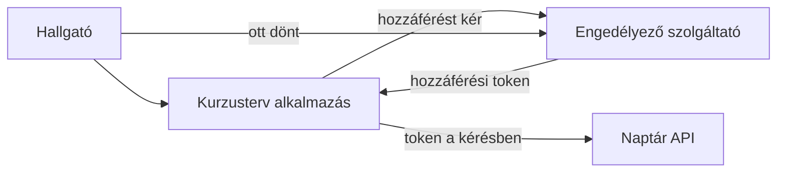
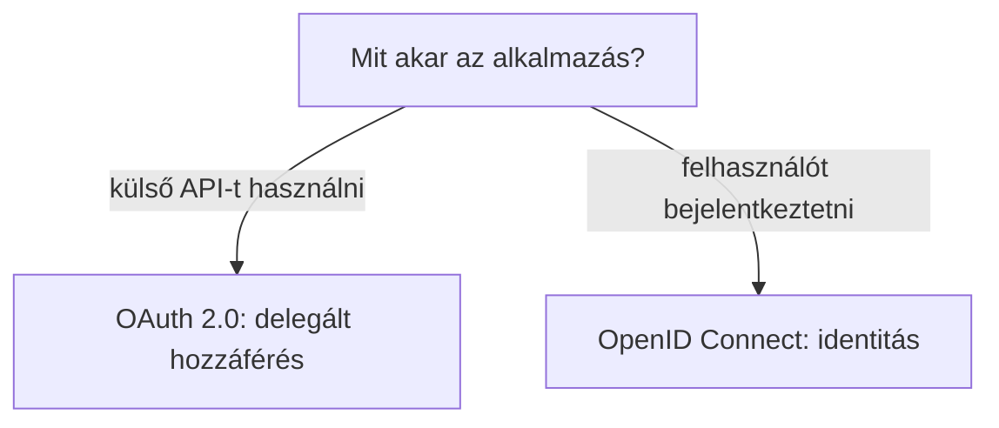

# 07.05. OAuth 2.0 és OpenID Connect

Egy webalkalmazás más szolgáltatás adataihoz is hozzáférhet a felhasználó engedélyével, vagy külső szolgáltatóra bízhatja a bejelentkezést. A két feladat hasonló átirányításokat és tokeneket használhat, de a céljuk más. Az OAuth 2.0 elsősorban delegált hozzáférés keretrendszere; az OpenID Connect erre épülő identitási protokoll, amely bejelentkezési információt is ad a kliensnek.

## Szükséges előismeretek

- [Hitelesítés és jogosultság](07-04-authentication-and-authorization.md) — az identitás és engedély különbsége.
- [Tokenek](07-03-browser-storage-and-tokens.md) — hozzáférési értékek szerepe.
- [Webes API](../05/05-01-what-is-a-web-api.md) — védett erőforrás kérése.

## Naptárhozzáférés jelszóátadás nélkül

A kurzustervező alkalmazás szeretné a hallgató órarendjét egy külső naptárba menteni. Rossz megoldás lenne elkérni a hallgató naptárszolgáltatói jelszavát. Delegált hozzáférésnél a hallgató a naptárszolgáltatónál jelentkezik be és ott dönt a kért hozzáférésről. A kurzustervező megfelelő jogosultságot képviselő hozzáférési tokent kaphat, amellyel a naptár API-ját használja. A jelszó így nem kerül a kurzustervezőhöz.

Az ábra fogalmi, nem teljes protokollüzenet-sor. A valós folyamat további ellenőrzéseket és átirányítási lépéseket tartalmaz. Az OAuth 2.0 célja itt az, hogy egy kliens korlátozott hozzáférést kapjon egy erőforráshoz anélkül, hogy a felhasználó jelszavát megkapná.

## Az OAuth 2.0 szereplői és célja

A felhasználó az erőforrás tulajdonosa lehet; a kurzustervező a kliens; az engedélyező szolgáltató hozzáférési tokent adhat; a naptár API-ja az erőforrás-szerver. A szerepek különválasztása segít megérteni, hogy a token nem általános „be vagyok jelentkezve mindenhová” igazolás. A hozzáférési token egy meghatározott erőforrás elérésére szolgál, az adott engedély és érvényességi feltételek szerint.

Az OAuth 2.0 önmagában nem szabványos válasz arra, hogy „ki a felhasználó a kliens alkalmazás számára?”. Egy hozzáférési tokent nem szabad automatikusan identitásigazolásként értelmezni. A token formája sem kötelezően JWT; lehet a kliens számára átláthatatlan érték. A részletes biztonsági lépéseket, például a megfelelő kódcserét és a támadások elleni védelmet itt nem tanuljuk protokollszinten.

## OpenID Connect: identitás a kliensnek

Az **OpenID Connect**, röviden OIDC, az OAuth 2.0 alapjaira épülő hitelesítési protokoll. Meghatározza, hogyan kaphat a kliens ellenőrizhető információt a felhasználó bejelentkezéséről és azonosítójáról. Ennek egyik eszköze az ID token, amelyet a kliensnek a saját céljára kell ellenőriznie. Az ID token nem helyettesíti az API-nak szánt hozzáférési tokent.

Ha a hallgató a kurzustervezőbe egy külső identitásszolgáltatóval lép be, a kurzustervező számára a felhasználó azonosítása a cél. Ehhez OIDC alkalmas. Ha ugyanaz az alkalmazás külön a naptárhoz szeretne hozzáférést, az delegált API-hozzáférés kérdése. A két folyamat egy felhasználói élményben összekapcsolódhat, de fogalmilag eltér.

## Tokentípusok és téves következtetések

> [!note] A hozzáférési token és az ID token célja eltér
> A hozzáférési tokent a védett erőforrás-szerverhez küldjük, és az annak szánt hozzáférést képviseli. Az ID token a kliens felé a hitelesítés eredményéről közöl ellenőrizhető állítást. A kettő eltérő közönségnek és célra készül. Ha egy kliens a hozzáférési tokenből próbálja kitalálni a felhasználó személyét, vagy ID tokent küld API-hozzáféréshez, felcseréli a protokoll szerepeit.

Az alkalmazás saját munkamenete külön életciklust is kaphat a külső szolgáltató bejelentkezésétől. Egy külső sikeres hitelesítés után a helyi alkalmazásnak továbbra is döntenie kell, milyen saját erőforrásokhoz ad hozzáférést a felismert felhasználónak. A külső azonosítás nem ad automatikus jogosultságot minden belső kurzusművelethez.

## Gyakori félreértések

| Állítás | Pontosítás |
| --- | --- |
| „Az OAuth 2.0 önmagában bejelentkezési protokoll.” | Elsődleges célja a delegált hozzáférés; identitáshoz OIDC ad meghatározott protokollt. |
| „A hozzáférési token megmondja a kliensnek, ki a felhasználó.” | Az erőforrás-szervernek szánt hozzáférést képviseli, nem általános identitásállítás. |
| „Az ID tokennel bármely API meghívható.” | Az ID token a kliensnek szóló hitelesítési állítás, nem API-hozzáférési token. |
| „Külső belépés után minden helyi művelet engedett.” | A helyi szolgáltatás saját jogosultsági döntése továbbra is szükséges. |

## Megismert fogalmak

- **OAuth 2.0:** Delegált hozzáféréshez használt keretrendszer, amelyben a kliens korlátozott jogosultságot kaphat egy védett erőforrás használatához.
- **OpenID Connect (OIDC):** OAuth 2.0-ra épülő hitelesítési protokoll, amely ellenőrizhető felhasználói identitásinformációt adhat a kliensnek.
- **Erőforrás-szerver:** A védett API-adatot vagy műveletet kínáló szolgáltatás, amely a megfelelő hozzáférési tokent ellenőrzi.
- **ID token:** OIDC-ben a kliensnek szánt, a hitelesítés eredményét kifejező token.
- **Delegált hozzáférés:** Olyan engedélyezés, amelyben egy alkalmazás a felhasználó jelszavának megismerése nélkül kap korlátozott hozzáférést más szolgáltatás erőforrásához.
