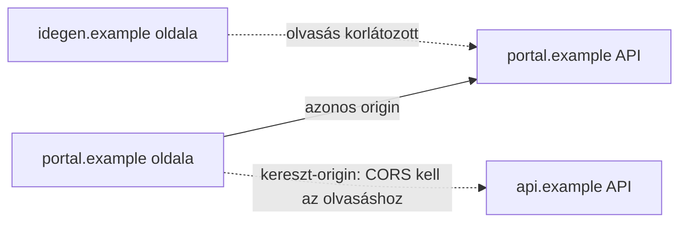
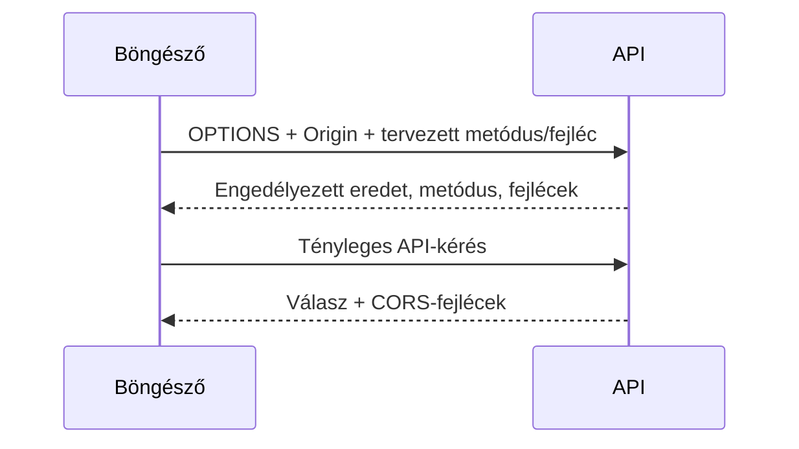

# 08.02. Same-origin policy és CORS

A böngésző különböző eredetű weboldalak között határt húz. A same-origin policy elsősorban azt korlátozza, hogy egy oldalon futó szkript milyen más eredetű választ olvashat vagy erőforrást érhet el. A CORS egy szerver által jelzett, böngészőben érvényesülő szabályrendszer az engedélyezett kereszt-eredetű olvasáshoz; nem általános API-jogosultság.

## Szükséges előismeretek

- [Webcímek és erőforrások](../02/02-01-web-addresses-and-resources.md) — séma, hosztnév és port.
- [HTTP-kérés és -válasz](../02/02-02-http-request-and-response.md) — üzenetek és fejlécek.
- [Webes API](../05/05-01-what-is-a-web-api.md) — kliens és API kapcsolata.

## Mit jelent az eredet?

Az origin a **séma, hosztnév és port** együttese. A `https://portal.example:443` és a `https://api.example:443` eltérő eredet, mert a hosztnév más. A `http://portal.example` és a `https://portal.example` is eltérő, mert a séma különbözik. Az útvonal nem része az originnek: a `/kurzusok` és a `/profil` ugyanazon a hoszton azonos séma és port mellett azonos eredetű.

Ha a hallgató egyszerre megnyitja a kurzusrendszert és egy idegen weboldalt, az idegen oldal JavaScriptje nem olvashatja egyszerűen a kurzusrendszer személyes API-válaszát. Ez a böngésző oldalak közötti elkülönítésének egyik alapja.

## Kérés küldése és válasz olvasása

A same-origin policy nem azt mondja, hogy böngészőből soha nem indulhat más eredet felé kérés. Képek, navigációk, űrlapok és bizonyos szkriptből indított kérések kereszt-eredetűek lehetnek. A fontos különbség gyakran az, hogy a küldő oldal JavaScriptje **hozzáférhet-e a válasz tartalmához**. Ettől a szerver még megkaphatja a kérést, és akár mellékhatás is történhet. Ezért a CORS-t nem szabad CSRF-védelemként vagy szerveroldali jogosultságellenőrzésként értelmezni.

## Mit tesz a CORS?

Ha a `portal.example` oldala a `api.example` API-t szeretné olvasni, a böngésző `Origin` fejlécben jelzi a kiinduló eredetet. A szerver az `Access-Control-Allow-Origin` válaszfejlécben jelezheti, mely eredet olvashatja a választ. Bizonyos módszerek és fejlécek esetén a böngésző előzetes `OPTIONS` kérést, preflightot küld, és csak az engedélyek alapján folytatja a tényleges kérést. A preflight nem minden kereszt-eredetű kérésnél jelenik meg.

Ha sütiket vagy más hitelesítési adatot is kezel a kereszt-eredetű kérés, a böngésző és a szerver további feltételeket érvényesít. A `*` minden eredetet engedélyező érték nem használható hitelesítési adatokat is tartalmazó CORS-válasznál. A cookie-k saját `SameSite` szabályai ettől külön réteget alkotnak.

## Mire nem való a CORS?

> [!warning] A CORS nem helyettesíti az API jogosultság-ellenőrzését
> A CORS böngészős olvasási korlát. Egy közvetlenül futtatott HTTP-kliensre nem ad általános hozzáférésvédelmet, és nem helyettesíti az API hitelesítését vagy jogosultságvizsgálatát. Az API-nak önállóan el kell döntenie, hogy a kérő elolvashatja vagy módosíthatja-e az adott adatot. A hibakeresésnél ezért külön kérdés, hogy a böngésző blokkolja-e a válasz olvasását, illetve hogy a szerver helyesen engedélyezte-e a műveletet.

## Gyakori félreértések

| Állítás | Pontosítás |
| --- | --- |
| „A CORS megvédi az API-t a nem kívánt kliensektől.” | A böngészőben a válasz olvasását szabályozza; szerveroldali hozzáférésvédelem továbbra is kell. |
| „Másik útvonal már másik origin.” | Az útvonal nem része az originnek. |
| „A CORS-hiba azt jelenti, hogy nem ment el kérés.” | Bizonyos esetekben a kérés elmehetett, csak a válasz nem olvasható a szkriptből. |
| „Minden CORS-kérés előtt van OPTIONS.” | Preflight csak meghatározott kereszt-eredetű kérésekhez szükséges. |

## Megismert fogalmak

- **Origin:** A séma, hosztnév és port hármasa.
- **Same-origin policy:** A böngésző eredetek közötti hozzáférést korlátozó alapelve.
- **CORS:** A szerver által HTTP-fejlécekkel jelzett, böngészőben érvényesülő kereszt-eredetű olvasási engedélyrendszer.
- **Preflight:** Bizonyos kereszt-eredetű kéréseket megelőző `OPTIONS` ellenőrző kérés.
