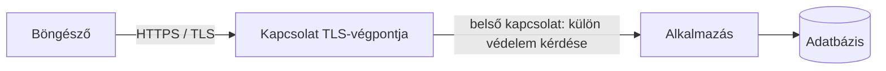

# 08.05. A HTTPS szerepe és korlátai a webbiztonságban

A HTTPS a böngésző és az adott hálózati végpont közötti kommunikációt védi. Megnehezíti, hogy egy közbeékelődő fél elolvassa vagy módosítsa a forgalmat, és tanúsítvány alapján ellenőrizhetővé teszi a kiszolgálóhoz kapcsolódó nevet. A HTTPS ugyanakkor nem igazolja, hogy egy alkalmazás üzleti logikája, jogosultságkezelése vagy megjelenített tartalma biztonságos.

## Szükséges előismeretek

- [TCP és TLS](../04/04-02-connection-tcp-and-tls.md) — kapcsolat és TLS.
- [A HTTPS védelme és határai](../04/04-03-https-protection-and-limits.md) — alapvető hálózati tulajdonságok.
- [Fenyegetési modell](08-01-threat-models-and-trust-boundaries.md) — melyik határt védjük.

## Ugyanaz a védelem más kérdésben

A negyedik héten a teljes kérés útjában néztük a TLS-t. Most ugyanazt a mechanizmust biztonsági ellenőrzésként értelmezzük. Egy nyilvános hálózaton a hallgató bejelentkezési kérése és a válasz személyes adatai ne legyenek egyszerűen olvashatók vagy észrevétlenül módosíthatók a kapcsolat köztes szakaszán. A TLS titkosítása és integritásvédelme ezt a szakaszt célozza. A tanúsítvány ellenőrzése segít, hogy a böngésző a várt hosztnévhez kapcsolódjon.

> [!warning] A TLS-védelemnek határa van
> Ha reverse proxy bontja a TLS-t, a böngésző és proxy közötti védelem nem írja le automatikusan a proxy és alkalmazásszerver közötti szakaszt. A teljes út és az üzemeltetési környezet határozza meg, hol kell még védeni a kommunikációt.

## Mit nem old meg a lakat ikon?

Egy HTTPS-sel elérhető oldal is lehet megtévesztő, ha a felhasználó rossz címre navigál. A TLS azt ellenőrzi, hogy a böngésző a megadott névhez kapcsolódó kiszolgálóval beszél; nem dönti el, hogy az adott szolgáltató megbízható-e. A HTTPS alatt szállított oldal tartalmazhat XSS-hibát, hibás CORS-beállítást vagy rossz jogosultságkezelést. Az injekciót sem állítja meg: a támadó által adott adat titkosított csatornán is eljut a szerverhez.

Egy biztonsági jelzés jelentése mindig a védett határhoz kötött. A HTTPS „védett kapcsolat” jelzése nem „hibátlan alkalmazás” minősítés. A böngésző figyelmeztetésének figyelmen kívül hagyása vagy a tanúsítványellenőrzés kikapcsolása éppen a hálózati védelem lényegét gyengíti.

## Vegyes tartalom és biztonságos cookie

Ha egy HTTPS-oldal nem védett HTTP-erőforrást próbál betölteni, vegyes tartalom jöhet létre. A böngészők ezt a kockázat szerint korlátozhatják vagy blokkolhatják, mert a nem védett rész módosítható lehet a hálózaton. A munkamenet-cookie `Secure` attribútuma biztosítja, hogy a böngésző ne küldje azt egyszerű HTTP-kapcsolaton. Ezek a beállítások a védett csatorna következetes használatát szolgálják.

## Gyakori félreértések

| Állítás | Pontosítás |
| --- | --- |
| „HTTPS esetén az alkalmazás biztonságos.” | A hálózati kapcsolat védelme nem helyettesíti az alkalmazási ellenőrzéseket. |
| „A lakat bizonyítja, hogy a webhely jóindulatú.” | A tanúsítvány a kapcsolódó névhez tartozó szervert igazolja, nem a szolgáltatás szándékát. |
| „A TLS minden belső szakaszt automatikusan véd.” | A TLS-végpont után külön kommunikációs szakasz lehet. |

## Megismert fogalmak

- **HTTPS:** HTTP-forgalom TLS-sel védett kapcsolaton.
- **TLS-végpont:** A hálózati hely, ahol a védett kapcsolat véget ér.
- **Vegyes tartalom:** HTTPS-oldal által nem védett HTTP-kapcsolaton betöltött erőforrás.
- **Tanúsítvány-ellenőrzés:** A kapcsolódó név és a kiszolgáló igazolásának ellenőrzése.
