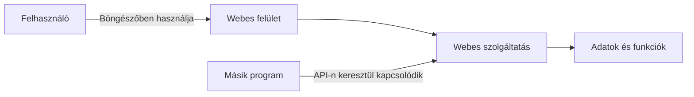

# A web mint általános platform

A web nem csupán egy alkalmazásfejlesztési terület. Az informatikai rendszerek jelentős része böngészőn keresztül érhető el, webes API-kon kommunikál, vagy a web szabványaira épül. Ezért minden informatikusnak értenie kell a web alapvető működését – akkor is, ha később nem webfejlesztőként dolgozik.

> [!note] Internet és web
> Az internet az összekapcsolt hálózatok infrastruktúrája; a web az ezen működő, címezhető erőforrásokra és közös kommunikációs szabályokra épülő rendszer. A különbség fontos kiindulópont, de nem önálló fejezetünk tárgya: innen továbblépve azt vizsgáljuk, miért lett a web ennyi különböző informatikai feladat közös platformja.

Egy informatikus ma gyakran akkor is webes döntések következményeivel találkozik, amikor egyetlen HTML-elemet sem ír. Egy adatelemző API-ból kapja az adatot, egy üzemeltető webes szolgáltatás válaszidejét figyeli, egy biztonsági szakember bejelentkezési folyamatot vizsgál, egy mobilfejlesztő pedig szerveroldali végpontokkal kommunikál. A webes alapismeret ezért közös szakmai nyelv: segít megérteni, hogyan kapcsolódnak össze a különböző szakterületek.

## A web általános platform

A web ma az egyik legfontosabb felület, amelyen keresztül az emberek digitális szolgáltatásokat használnak. Egyetemi rendszerek, bankok, webáruházak, közintézmények, vállalati belső rendszerek, közösségi platformok és üzleti szoftverek is gyakran böngészőből érhetők el.

Ez nem véletlen. A böngésző szinte minden korszerű eszközön elérhető, a web nyílt szabványokra épül, és egy jól megtervezett webes szolgáltatás sokféle operációs rendszeren használható külön telepítés nélkül. A web tehát nem egyetlen alkalmazás vagy technológia, hanem egy általános elérési és integrációs platform.

Egy informatikai rendszerben a web többféle szerepet tölthet be:

- **felhasználói felület:** itt használja a rendszer funkcióit az ügyfél, az oktató vagy az alkalmazott;
- **kommunikációs réteg:** webes API-kon keresztül cserélnek adatot különböző rendszerek;
- **publikációs felület:** itt jelennek meg dokumentumok, hírek, nyilvános adatok és szolgáltatások;
- **integrációs közeg:** eltérő technológiával készült rendszerek kapcsolódhatnak egymáshoz szabványos webes interfészeken.

Az alábbi ábra azt mutatja, hogy ugyanaz a webes platform embereknek felületet, programoknak pedig kapcsolódási pontot adhat:

## Nem csak a webfejlesztő használ webes technológiákat

Nem minden hallgató lesz frontend- vagy backendfejlesztő. A web működésének ismerete mégis sok más informatikai feladatban segít.

| Szakterület | Miért fontosak a webes alapok? |
| --- | --- |
| Szoftverfejlesztés | Sok alkalmazás webes API-val, adminisztrációs felülettel vagy online szolgáltatással kapcsolódik össze. |
| Adatbázisok és adatelemzés | Az adatok gyakran webes szolgáltatásokból érkeznek, illetve böngészős felületen jelennek meg. |
| Kiberbiztonság | A leggyakoribb támadási felületek jelentős része webes: bejelentkezés, adatbeküldés, böngésző és API. |
| Hálózatok és üzemeltetés | A webes forgalom, a DNS, a TLS és a rendelkezésre állás megértése napi szintű feladat. |
| Mobilfejlesztés | A mobilalkalmazások jellemzően webes API-kon keresztül kommunikálnak a háttérrendszerekkel. |
| Mesterséges intelligencia | Modellek és MI-szolgáltatások gyakran webes interfészen vagy API-n keresztül érhetők el. |
| Beágyazott rendszerek és IoT | Eszközök gyakran webes vezérlőfelületet vagy felhőalapú webes szolgáltatást használnak. |

Az alapelv egyszerű: ha egy rendszer emberekkel vagy más rendszerekkel kommunikál az interneten keresztül, nagy valószínűséggel találkozunk webes fogalmakkal.

## A webes alapműveltség nem egyenlő a webfejlesztői szakosodással

Ebben a tárgyban nem az a cél, hogy a hallgatók megtanuljanak egy adott keretrendszerben alkalmazást készíteni. A konkrét eszközök gyorsan változnak: egy ma népszerű JavaScript-keretrendszer néhány év múlva kevésbé lehet meghatározó. A mögöttes alapelvek azonban sokkal tartósabbak.

A kurzus ezért olyan kérdéseket helyez előtérbe, mint:

- Mi történik, amikor egy böngésző weboldalt kér le?
- Hogyan kommunikál egy kliens egy szerverrel?
- Miért van szükség HTTPS-re, cookie-kra vagy hitelesítésre?
- Hogyan kapcsolódnak össze webes szolgáltatások API-kon keresztül?
- Mitől biztonságos, gyors, akadálymentes és jogszerű egy webes szolgáltatás?

Ezek az ismeretek akkor is hasznosak maradnak, ha a hallgató később Java-, Python-, mobil-, adatelemző vagy biztonsági területen dolgozik.

## A webes döntéseknek valódi következményeik vannak

Egy webes szolgáltatás minősége közvetlenül érinti a felhasználókat. Egy rosszul kialakított bejelentkezési folyamat biztonsági kockázatot jelenthet. Egy lassú oldal üzleti veszteséget vagy frusztrációt okozhat. Egy akadálymentességi szempontokat figyelmen kívül hagyó felület embereket zárhat ki a szolgáltatás használatából. Egy átláthatatlan adatkezelés pedig jogi és etikai problémákat vethet fel.

Ezért a webprogramozás tanulása nem kizárólag technikai kompetencia. A tárgy a felelős digitális szolgáltatástervezéshez is ad szempontrendszert.

## Példa: egy egyetemi tanulmányi rendszer

Egy egyetemi tanulmányi rendszer jól mutatja, miért kapcsolódik sok informatikai terület a webhez:

- a hallgató böngészőben használja a felületet;
- a rendszer HTTPS-en keresztül kommunikál;
- bejelentkezéskor kezeli a hallgató identitását és jogosultságait;
- az adatok adatbázisból érkeznek;
- más rendszerekkel, például fizetési vagy levelezési szolgáltatásokkal API-kon keresztül kapcsolódhat;
- nagy terhelés esetén is működőképesnek kell maradnia;
- személyes adatokat kezel, ezért adatvédelmi követelményeknek kell megfelelnie;
- akadálymentesen használhatónak kell lennie.

Egy ilyen rendszer megértéséhez nincs szükség arra, hogy minden hallgató megírja a kódját. A működés, a kapcsolatok és a kockázatok átlátása azonban minden informatikus számára értékes.

## Gyakori félreértések

| Állítás | Pontosítás |
| --- | --- |
| „Webprogramozást csak webfejlesztőknek kell tanulni.” | A webes rendszerek sok informatikai szakterületet kötnek össze. |
| „A tárgy csak HTML-ről és weboldalak kinézetéről szól.” | A web ennél tágabb: kommunikáció, biztonság, adatok, böngészők és szolgáltatások rendszere. |
| „A technológiák úgyis gyorsan változnak, ezért a tárgy hamar elavul.” | A konkrét eszközök változnak, de a protokollok, szabványok és alapelvek hosszabb távon is fontosak. |
| „A webes kérdések csak a fejlesztő feladatai.” | Biztonsági, adatvédelmi, üzemeltetési és termékdöntések is kapcsolódnak hozzájuk. |
