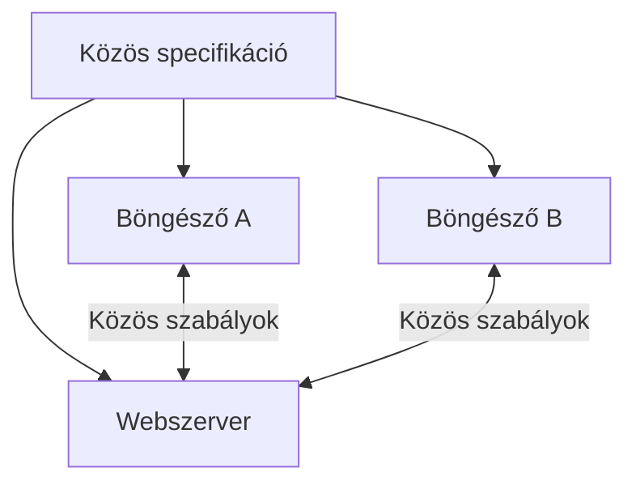

# Webszabványok és interoperabilitás

A web azért működhet világszerte különböző eszközökön és különböző gyártók termékein, mert közös, nyilvánosan hozzáférhető szabványokra épül. Az interoperabilitás nem mellékes kényelmi funkció, hanem a web egyik alapértéke.

Gondoljunk arra, milyen elvárásunk van, amikor egy egyetemi linket elküldünk valakinek: a címnek telefonon, laptopon, másik operációs rendszeren és lehetőleg másik böngészőben is működnie kell. Nem azért, mert minden eszköz azonos, hanem mert a résztvevők közös szabályokat követnek. A szabványok ezt a hallgatólagos ígéretet teszik műszakilag megvalósíthatóvá.

## Közös szabályok nélkül nincs közös web

Egy weboldal készítője nem tudhatja előre, hogy a látogató milyen számítógépet, telefont, operációs rendszert vagy böngészőt használ. A web akkor tud működni ilyen sokféle környezetben, ha a résztvevők közös szabályokat követnek.

Ilyen szabály például, hogy egy HTML-cím mit jelent, hogyan épül fel egy HTTP-kérés, vagy miként kell egy URL-t értelmezni. A szabvány nem a konkrét programkódot írja elő, hanem azt, hogy a különböző megvalósításoknak milyen megfigyelhető viselkedést kell nyújtaniuk.

## Szabvány, specifikáció és implementáció

- A **szabvány** közösen elfogadott technikai szabályrendszer.
- A **specifikáció** ennek részletes, írásos leírása.
- Az **implementáció** egy konkrét böngésző, szerver vagy fejlesztői eszköz megvalósítása, amely igyekszik követni a specifikációt.

Például a HTML szabvány meghatározza egy elem jelentését és feldolgozását. A Chrome, Firefox és Safari eltérő programok, de ugyanazt a HTML-dokumentumot lehetőleg hasonlóan kell megjeleníteniük.

A közös leírásból több, egymástól független megvalósítás készülhet:

## Fontos szabványosító közösségek

| Szervezet vagy közösség | Fő szerep | Példák |
| --- | --- | --- |
| W3C | Webes ajánlások és irányelvek kidolgozása | akadálymentességi irányelvek, webes technológiák |
| WHATWG | A böngészők által használt webes platform több élő szabványának gondozása | HTML, DOM, URL-szabványok |
| IETF | Internetes protokollok szabványosítása | HTTP, TLS, DNS, IP-hez kapcsolódó szabványok |

Ezek a szervezetek nem „irányítják az internetet” egyetlen központból. Inkább olyan nyílt együttműködési folyamatokat biztosítanak, amelyekben gyártók, fejlesztők, kutatók és más érdeklődők egyeztethetnek a közös megoldásokról.

## Interoperabilitás

Az interoperabilitás azt jelenti, hogy különböző rendszerek együtt tudnak működni. A weben ez több szinten is fontos:

- ugyanaz az oldal több böngészőben használható;
- egy szerver képes többféle klienssel kommunikálni;
- egy API-t különböző programozási nyelven írt alkalmazások is elérhetnek;
- a felhasználó nem kényszerül egyetlen gyártó teljes ökoszisztémájába.

Az interoperabilitás nem tökéletes. Előfordulhatnak böngészőközi eltérések, eltérő támogatottságú funkciók és régebbi rendszerekből örökölt korlátok. A szabványok és a kompatibilitási tesztek célja éppen ezek csökkentése.

## Nyílt szabványok és függőségek

A nyílt szabvány dokumentációja hozzáférhető, és a szabványt elvileg több, egymástól független szereplő is megvalósíthatja. Ez támogatja a versenyt, a választási szabadságot és a hosszú távú hozzáférhetőséget.

Ezzel szemben a kizárólag egy gyártó saját technológiájára épülő megoldás vendor lock-int, azaz szolgáltatói függőséget okozhat. Ilyenkor a felhasználónak vagy a fejlesztőnek nehezebb más eszközre, szolgáltatóra vagy platformra váltania.

## Példa: „Ez az oldal csak ebben a böngészőben működik”

Ha egy szolgáltatás csak egyetlen böngészőben használható, annak oka lehet hibás vagy hiányos megvalósítás, nem szabványos technológia használata, vagy hiányzó kompatibilitási tesztelés. Egy kritikus szolgáltatásnál – például állami ügyintézésnél vagy egyetemi rendszerben – ez különösen problémás, mert korlátozza a hozzáférést.

## Gyakori félreértések

| Állítás | Pontosítás |
| --- | --- |
| „A szabvány megakadályozza az innovációt.” | A közös alapokra építve könnyebb új, széles körben használható megoldásokat létrehozni. |
| „Ha egy funkció működik Chrome-ban, akkor mindenhol működik.” | A böngészők támogatása és hibái eltérhetnek. |
| „A W3C egy hatóság, amely kötelező törvényeket hoz.” | A W3C ajánlásokat és szabványokat dolgoz ki; a jogi kötelezettség más forrásból eredhet. |
