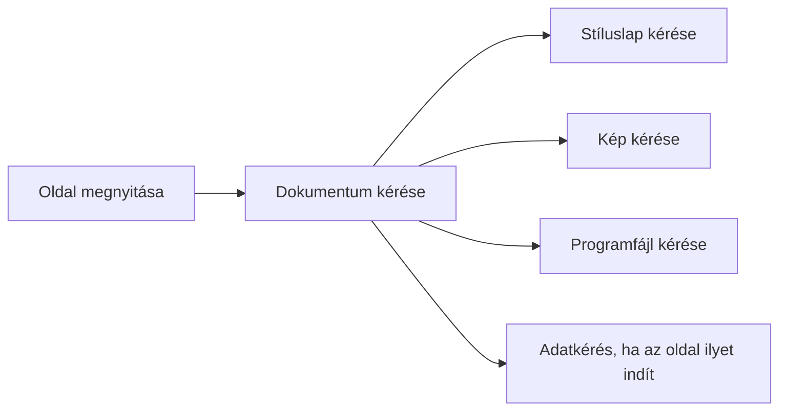
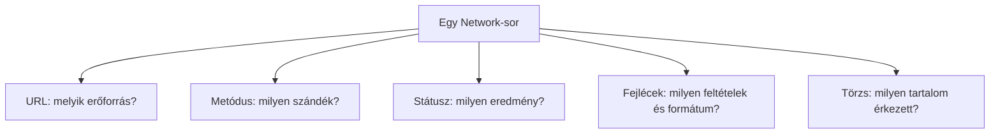

# Egy webes kérés megfigyelése a Network panelen

A böngésző fejlesztői eszközeinek Network panelje megfigyelhetővé teszi a webes kéréseket és válaszokat. Nem helyettesíti a HTTP fogalmi megértését, de segít összekapcsolni a címeket, metódusokat, státuszkódokat, fejléceket és válaszbeli tartalmat egy valódi oldalbetöltéssel. Ezen a héten az alapvető olvasás a cél, nem a teljes hálózati diagnosztika.

## Mit látunk a listában?

Képzeljük el, hogy a hallgató megnyit egy nyilvános kurzusoldalt. A Network panelben több sor jelenhet meg: a dokumentum kérése mellett stíluslapok, képek vagy programfájlok kérései is. Egy sor rendszerint egy hálózati kéréshez tartozik. A böngészők kezelőfelülete eltér, de általában látható a cél neve vagy URL-je, a metódus, a státusz, a tartalom típusa és bizonyos időadatok.

Ez a vázlat nem kötelező sorrendet jelent: a böngésző több erőforrást párhuzamosan is kérhet, és egy konkrét oldal nem feltétlenül használ minden felsorolt típust. A harmadik héten részletesebben látjuk, hogyan épül fel a megjelenített dokumentum ezekből az erőforrásokból.

## Egy sor értelmezése

Válasszuk ki a fő dokumentum sorát. Először az URL-t érdemes azonosítani: valóban a beírt címhez tartozik-e, vagy átirányítás után másik címre jutottunk? Ezután nézzük meg a metódust. Egy dokumentum egyszerű megnyitásakor jellemzően GET-et látunk. A státuszkód megmutatja, hogy a kérés HTTP-szinten milyen eredménnyel zárult. A `200` siker, a `301` vagy `302` további címre irányíthat, a `404` hiányzó erőforrást jelölhet.

Az időadatok fontosak, de egyetlen nagy szám nem mondja meg önmagában, miért volt lassú az oldal. Különböző fázisok, szerveroldali feldolgozás és erőforrás-betöltés is szerepet játszhatnak. A részletes teljesítményelemzés későbbi téma.

## Kérés- és válaszfejlécek

Egy sor részleteiben külön láthatók lehetnek a kérés és a válasz fejlécei. A kérésben például az `Accept` azt jelezheti, milyen tartalmat szeretne a kliens. A válasz `Content-Type` fejléce megmutathatja, hogy HTML, JSON vagy más tartalom érkezett. Átirányításnál a `Location` adhatja az új címet. Ha a válasz JSON, a böngésző külön nézetben strukturáltan is megjelenítheti, de a formázott nézet továbbra is ugyanahhoz a válaszhoz tartozik.

A Network panel gyakran olyan fejléceket is megmutat, amelyeket most még nem tanultunk: cookie-kat, gyorsítótárra vonatkozó mezőket vagy biztonsági szabályokat. Ezeket nem kell az első megfigyeléskor mind megfejteni. Elég azt felismerni, melyik rész kérés, melyik válasz, hol van a státusz, és hogyan azonosítjuk a kapott tartalom típusát.

## Átirányítás és több kérés

Ha az első kérés 3xx státuszkóddal és `Location` fejléccel válaszol, a böngésző új kérést indíthat. A felhasználó ilyenkor egyetlen oldalt lát, de a panelben egy átirányítási lánc szerepel. Másképp keletkezik több sor akkor, ha a HTML további erőforrásokra hivatkozik. Az első esetben ugyanannak a navigációnak a célpontja változik; a másodikban a megjelenítéshez szükséges további tartalmak érkeznek. A két jelenség elkülönítése segít helyesen olvasni a panelt.

## Mit bizonyít a megfigyelés?

> [!tip] A látható bizonyítékokból következtess
> A Network panel a böngésző nézőpontját mutatja. Láthatjuk, hogy a kliens milyen kérést indított és milyen választ kapott. Nem látjuk közvetlenül, milyen adatbázis-lekérdezést futtatott a szerver, vagy pontosan mely belső szabály alapján döntött. Egy `500` válasz például szerveroldali problémát jelez, de önmagában nem nevezi meg az okot. A megfigyelést ezért mindig a látható adatok határain belül értelmezzük.

A panelben érzékeny információ is előfordulhat, például munkamenethez kapcsolódó fejlécek vagy személyes adatot tartalmazó kérés. Hibajelentéskor nem helyes teljes fejlécet, cookie-t vagy tokent nyilvánosan megosztani. A tanulási célhoz elegendő az URL megfelelően kiválasztott része, a metódus, a státuszkód, néhány releváns fejléc neve és a tartalom típusa.

## Gyakori félreértések

| Állítás | Pontosítás |
| --- | --- |
| „Egy sor egy teljes weboldal.” | Egy sor rendszerint egy kérés; az oldal több erőforrásból állhat. |
| „A Network panel megmutatja a szerver teljes belső működését.” | A böngésző felől látható kommunikációt mutatja. |
| „A 200-as státusz bizonyítja, hogy az egész oldal hibátlan.” | Csak az adott kérés HTTP-szintű sikerét jelzi. |
| „Minden fejléc biztonságosan megosztható.” | Egyes fejlécek érzékeny adatot tartalmazhatnak. |
