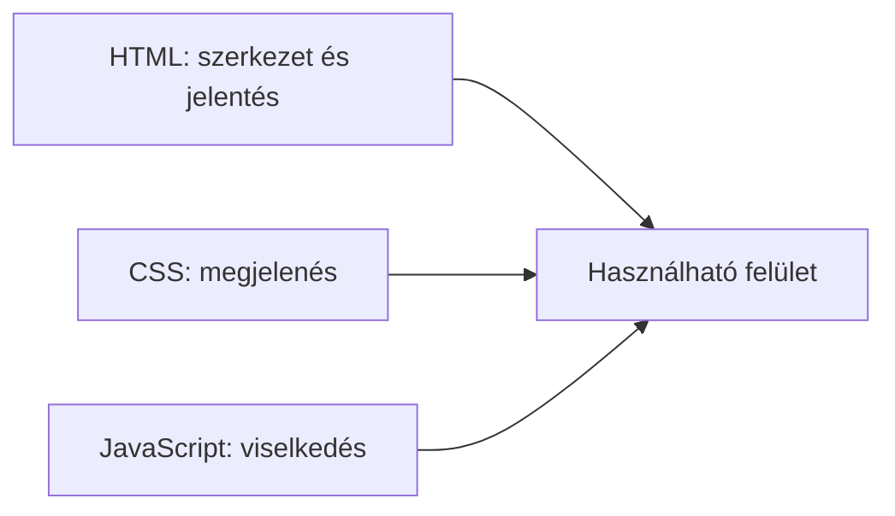

# HTML, CSS és JavaScript: a webes felület három szerepe

Egy weboldal egységes felületnek látszik, de a böngésző eltérő feladatú erőforrásokat dolgoz fel. A HTML a tartalom szerkezetét és jelentését írja le, a CSS a megjelenést alakítja, a JavaScript pedig programozható viselkedést adhat hozzá. A három szerep szétválasztása segít érthető, módosítható és többféle környezetben használható felületet készíteni.

## Egy kurzusoldal három nézőpontból

A hallgató megnyit egy kurzusoldalt. Lát egy címet, leírást és jelentkezési hivatkozást. A HTML jelöli, hogy melyik rész cím, bekezdés vagy hivatkozás. A CSS olvashatóvá és különböző képernyőméreteken használhatóvá teszi az elrendezést. A JavaScript például azonnal jelezheti, ha a hallgató kiválasztott egy szűrőt; az oldal alapvető leírásához azonban nincs feltétlenül szükség rá.



Az ábra együttműködést mutat, nem azt, hogy mindhárom technológia minden oldalon kötelező. Egy egyszerű dokumentum HTML-lel is olvasható lehet.

## HTML: mit jelent a tartalom?

A HTML leíró nyelv. Elemekkel jelöli például a címsort, bekezdést, listát, hivatkozást, gombot és űrlapot. A böngésző ebből dokumentumszerkezetet épít. A HTML nem a betűk pontos színét vagy egy elem végleges képernyőpozícióját írja le.

```html
<main>
  <h1>Webprogramozás I</h1>
  <p>A kurzus a web működésének alapjait tárgyalja.</p>
  <a href="/jelentkezes">Jelentkezés</a>
</main>
```

Ebben a rövid példában a `main` a fő tartalmat, a `h1` a főcímet, a `p` bekezdést, az `a` pedig hivatkozást jelöl. A címek és elemek jelentése nem csak a látó olvasónak hasznos: a böngésző, a keresőmotor és a segítő technológiák is támaszkodhatnak rá. A szemantikus szerkezetet a következő fejezet részletezi.

## CSS: hogyan jelenjen meg?

A CSS szabályokkal írja le a megjelenést: színt, betűméretet, térközt, elrendezést és többek között a különböző kijelzőkhöz való alkalmazkodást. Ugyanarra a HTML-dokumentumra több stílus is hatással lehet. A böngésző az egymással versengő szabályokat a CSS megfelelő prioritási és öröklési szabályai szerint értelmezi.

```css
main { max-width: 48rem; margin: auto; }
h1 { color: #17365d; }
```

A CSS nem pusztán díszítés. Az olvasható sorköz, a megfelelő kontraszt és a keskeny képernyőn is működő elrendezés mind befolyásolja, hogy az információ használható-e. A CSS megváltoztathatja a látható elrendezést anélkül, hogy a dokumentum alapvető jelentése megváltozna.

## JavaScript: hogyan reagáljon a felület?

A JavaScript programozási nyelv. A böngészőben futó kód figyelhet felhasználói eseményeket, módosíthatja a dokumentum aktuális állapotát, vagy új adatot kérhet a szervertől. Például a kurzuskereső szűréskor frissítheti a találatok listáját anélkül, hogy a felhasználó külön új oldalra lépne.

> [!warning] A szerveren is ellenőrizd a bemenetet
> A JavaScript által végzett kliensoldali ellenőrzés kényelmes visszajelzést adhat, de nem helyettesíti a szerveroldali szabályokat. Ha a jelentkezéshez előfeltétel kell, annak végső ellenőrzését nem szabad kizárólag a felhasználó eszközén futó kódra bízni. A böngészőoldali program hibázhat, késve töltődhet be vagy megkerülhető.

## Fokozatosan épülő felület

Egy tájékoztató oldal értelmes HTML-tartalommal indulhat. A CSS áttekinthetőbbé teszi, a JavaScript pedig szükség esetén kényelmi funkciókat ad hozzá. Ez a fokozatos fejlesztés elve: a fontos tartalom és alapművelet lehetőleg ne függjön fölöslegesen egy később érkező vagy hibás programtól.

Ez nem jelenti azt, hogy minden alkalmazás JavaScript nélkül is teljes egészében működhet. Egy összetett böngészős szerkesztő más igényű, mint egy kurzusleírás. A helyes kérdés az, hogy melyik funkcióhoz mi szükséges, és mi történik, ha az egyik erőforrás nem érkezik meg. A következő fejezet megmutatja, hogyan alakítja a böngésző a HTML-t élő dokumentummodellé.

## Gyakori félreértések

| Állítás | Pontosítás |
| --- | --- |
| „A HTML csak a kinézet vázlata.” | A szerkezet mellett az elemek jelentését is jelöli. |
| „A CSS csak díszítés.” | Az olvashatóságot és az alkalmazkodó elrendezést is meghatározza. |
| „Minden modern oldalnak sok JavaScript kell.” | A szükséges viselkedés mértékét a feladat határozza meg. |
| „A kliensoldali ellenőrzés elég a szabályok védelméhez.” | A fontos alkalmazási szabályokat a szervernek is ellenőriznie kell. |
