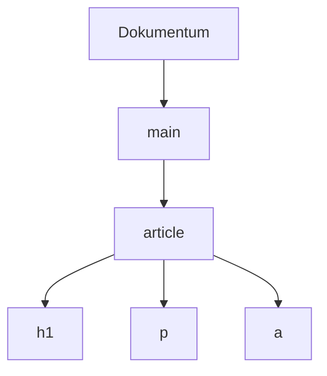

# Dokumentumszerkezet, DOM és szemantika

A böngésző nem képet kap a szervertől, hanem többek között HTML-szöveget, amelyből feldolgozható dokumentummodellt épít. A DOM a dokumentum aktuális, faalakú modellje. A helyes HTML-szerkezet és szemantika abban segít, hogy a tartalom nemcsak látható, hanem értelmezhető és használható legyen különböző emberek és eszközök számára.

## A HTML-forrásból dokumentumfa lesz

Tegyük fel, hogy a hallgató egy kurzushírt nyit meg. A szerver HTML-válasza szöveges jelölés. A böngésző ezt elemzi, és egymásba ágyazott objektumokból álló fát épít. A dokumentum gyökeréhez kapcsolódik a `html`, alatta a `head` és a `body`, majd a tartalmi elemek. A DOM — Document Object Model — ezt a programból is kezelhető struktúrát jelöli.

```html
<main>
  <article>
    <h1>Megnyílt a kurzusjelentkezés</h1>
    <p>A jelentkezés péntekig tart.</p>
    <a href="/kurzusok">Kurzusok</a>
  </article>
</main>
```



A fa nem egy második HTML-fájl. A böngésző memóriájában élő modell: a HTML-feldolgozás létrehozza, a JavaScript pedig később módosíthatja. Az ábra a fő elemek szülő–gyermek kapcsolatait szemlélteti; a tényleges DOM szöveges csomópontokat és további részleteket is tartalmaz.

## Forrás és aktuális DOM

A szervertől kapott HTML-forrás és a böngésző pillanatnyi DOM-ja nem mindig azonos. A böngésző bizonyos hibás vagy hiányos HTML-t a szabályok szerint javítva értelmezhet. A JavaScript később új elemet szúrhat be, szöveget cserélhet vagy meglévő elemet távolíthat el. Emiatt a „forrás megtekintése” és a fejlesztői eszköz Elements vagy Inspector nézete eltérő tartalmat mutathat.

Például egy jelentkezési állapotot jelző szöveg kezdetben „Nincs kiválasztott kurzus” lehet. A felhasználó választása után a JavaScript az aktuális DOM-ban „Webprogramozás I kiválasztva” szövegre változtathatja. Ettől a szerver által korábban küldött forrásfájl nem íródik át. Az aktuális felület és az eredeti HTML különböző megfigyelési pontok.

## A szemantikus elem többet mond a kinézetnél

A `h1` főcímet, a `p` bekezdést, az `a` hivatkozást jelöl. A `main` a fő tartalmi régió, az `article` önálló tartalmi egység. Az elem kiválasztása tehát nem csak vizuális döntés. Egy címsor nem attól lesz címsor, hogy nagy betűvel jelenik meg; a HTML-szerepe is ezt kell kifejezze. A képernyőolvasók, keresők és más programok támaszkodhatnak erre a szerkezetre.

> [!tip] Használj natív vezérlőelemeket
> Egy kattintható `div` CSS-sel gombnak látszhat, de önmagában nem kapja meg a valódi `button` elem összes billentyűzetes és szemantikai tulajdonságát. A megfelelő natív elem használata ezért sok esetben egyszerűbb és hozzáférhetőbb megoldás. A szemantikus HTML nem teljes akadálymentességi garancia, de fontos alapja annak.

## Szerkezet és hierarchia

A dokumentum címei segítenek a tartalom áttekintésében. Egy főcím után a részeket alcímek tagolhatják. A hivatkozás szövege legyen önmagában érthető; a „kattints ide” kevés információt ad arról, hova vezet. Az űrlapmezők címkéi pedig segítenek azonosítani, milyen adatot vár a felület. Ezek mind a tartalom jelentését teszik olvashatóvá, nem pusztán a látványát.

A DOM-fában a szülő–gyermek kapcsolat a CSS és a JavaScript számára is számít. Egy stílusszabály például megcélozhatja az `article` alatti bekezdéseket. A JavaScript megkereshet egy elemet az azonosítója alapján, majd módosíthatja a szövegét. Ha a HTML szerkezete rendezetlen, ezek a műveletek is nehezebben követhetők.

## A fejlesztői eszköz nézőpontja

Az Elements vagy Inspector nézet a böngésző aktuális dokumentumfáját mutatja. Egy elem kijelölésekor látható az elhelyezkedése a fában, több attribútuma és a rá ható stílusok. Ez más kérdésre válaszol, mint az előző heti Network panel. A Network azt mutatta, milyen erőforrás érkezett; az Elements azt, milyen dokumentummal dolgozik most a böngésző.

Ha egy szöveg a Network válaszában még nem, az aktuális DOM-ban viszont már látszik, valószínűleg a betöltés utáni program módosította vagy később érkezett adatból épült fel. Ez következtetés, nem önmagában bizonyíték a teljes belső működésre. A két nézet együtt azonban sokkal pontosabb képet ad az oldalról.

## Gyakori félreértések

| Állítás | Pontosítás |
| --- | --- |
| „A DOM ugyanaz a fájl, amit a szerver küldött.” | A böngésző aktuális, változható belső modellje. |
| „A nagy betűs szöveg automatikusan címsor.” | A vizuális méret nem helyettesíti a megfelelő HTML-elemet. |
| „Minden kattintható elem gomb.” | A natív gomb szemantikája és billentyűzetes viselkedése külön tulajdonság. |
| „A forrás és az Elements nézet mindig azonos.” | Feldolgozás és JavaScriptes változás miatt eltérhetnek. |
