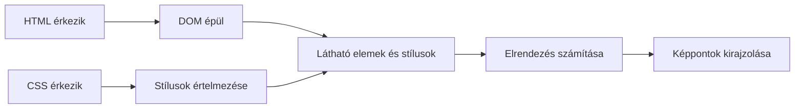

# Hogyan jeleníti meg a böngésző az oldalt?

A HTTP-válasz megérkezése még nem egyenlő a kész, látható oldallal. A böngésző a dokumentumot feldolgozza, stílusokat alkalmaz, méreteket és helyeket számol, majd kirajzolja az eredményt. Ezek a lépések egymásra épülnek, de a böngésző közben új erőforrásokat kérhet és a felületet többször is frissítheti. Az egyszerűsített modell segít megérteni, miért jelenhet meg egy oldal fokozatosan.

## A hallgató egy oldalt lát, a böngésző több feladatot végez

A hallgató megnyitja a kurzusoldalt, majd először megjelenik a cím és a szöveg. Egy kép később érkezik, az egyedi betűtípus még később váltja fel az alapértelmezettet. A képernyőn látható oldal tehát nem mindig egyetlen pillanatban készül el. A böngésző a kapott HTML alapján felfedezi a további szükséges erőforrásokat, értelmezi a stílusokat, és fokozatosan alakítja a megjelenítést.

Az ábra oktatási egyszerűsítés. A tényleges böngészőmotorok párhuzamosan és több részletben dolgozhatnak; a JavaScript és későbbi erőforrások újabb változásokat indíthatnak.

## A HTML feldolgozása

A böngésző a HTML-ből DOM-fát épít. A HTML nem csak tartalom, hanem további erőforrások hivatkozásait is tartalmazhatja: egy `link` stíluslapot, egy `img` képet, egy `script` JavaScriptet jelölhet. A böngésző ezekhez további kéréseket indíthat. Nem kell megvárnia, hogy minden lehetséges erőforrás megérkezzen ahhoz, hogy a dokumentum egyes részeit értelmezni kezdje.

A helyes szerkezet azért fontos, mert a DOM adja a további feldolgozás egyik alapját. Hibásan egymásba ágyazott elemekből a böngésző a szabályai szerint próbál használható fát készíteni, de az eredmény nem feltétlenül az, amit a szerző tervezett. A valid, szemantikus HTML tehát nem puszta formai követelmény.

## Stílusok és látható elemek

A CSS-fájlokban szelektorok és szabályok írják le, hogyan jelenjenek meg az elemek. A böngésző a CSS-t is feldolgozza, majd a dokumentum elemeire kiszámolja az alkalmazandó stílusokat. A CSSOM kifejezés a CSS feldolgozott, objektumszerű reprezentációjára utal. A DOM és a stílusinformáció együtt segít meghatározni, mely elemek kerülnek a képernyőre és hogyan.

Nem minden DOM-elem jelenik meg közvetlenül a képernyőn. Egy `display: none` stílusú elem például jelen lehet a dokumentumfában, de nem vesz részt a látható elrendezésben. Más elemek ál-elemeket vagy több kirajzolási darabot eredményezhetnek. Ezért a „DOM-fa” és a „képernyőn látható fa” nem azonos fogalom.

## Elrendezés és kirajzolás

Az elrendezés során a böngésző kiszámolja a látható elemek méretét és helyét. A kirajzolás során ezekből képpontok lesznek; bizonyos esetekben további rétegek összerakása is szükséges. A részletes böngészőmotor-architektúrát ezen a héten nem kell megtanulni. A fontos különbség az, hogy az elem létezése, stílusa, geometriai helye és tényleges rajzolása külön lépések.

Ha a betűtípus később érkezik, megváltozhat a szöveg mérete és tördelése. Ha egy kép mérete előre nem ismert, a betöltés után elmozdulhat az alatta lévő tartalom. A felhasználó szempontjából ez zavaró lehet, különösen akkor, ha éppen egy gombra készül kattintani. A stabil megjelenítés tehát nem csak esztétikai cél.

## JavaScript és újrarajzolás

JavaScript módosíthatja a DOM-ot vagy a stílusokat. Egy „Részletek megnyitása” gomb kattintása után például új szöveg válhat láthatóvá. A böngészőnek ekkor a változás jellegétől függően újra kell számolnia vagy rajzolnia bizonyos részeket. Nem minden változás ugyanolyan költségű: egy szöveg hozzáadása más munkát igényelhet, mint egy csak színt módosító változás.

A JavaScript futása bizonyos helyzetekben késleltetheti a HTML feldolgozását vagy a felület reakcióját. Ezért a kód mennyisége és betöltési módja gyakorlati minőségi kérdés. Ugyanakkor egy interaktív alkalmazás számára a JavaScript szükséges lehet. A feladat nem az, hogy önmagában elkerüljük, hanem hogy értsük a szerepét és következményeit.

## Mit jelent az, hogy „betöltött”?

Az oldal betöltése nem egyetlen tökéletes pillanat. A böngésző előbb mutathat használható szöveget, miközben egy alacsonyabb prioritású kép még érkezik. Fordítva is előfordulhat: minden fájl letöltődött, de egy hosszú JavaScript-feladat miatt a felület még nem reagál megfelelően. A minőséget ezért a felhasználó által érzékelt megjelenés és reakció alapján is vizsgálni kell, nem csak a hálózati lista utolsó sorának idejével.

A Network panel a kérések és válaszok megfigyelésére jó, az Elements/Inspector a DOM és stílusok vizsgálatára. Egyik nézet sem helyettesíti a felhasználói tapasztalatot, de együtt segítenek megérteni, miért olyan a látható oldal, amilyen.

## Gyakori félreértések

| Állítás | Pontosítás |
| --- | --- |
| „A szerver kész képet küld a böngészőnek.” | A böngésző jellemzően dokumentumot és erőforrásokat dolgoz fel. |
| „A HTML-válasz megérkezésekor minden látható.” | További erőforrások és feldolgozási lépések szükségesek lehetnek. |
| „A DOM minden eleme látható a képernyőn.” | Bizonyos elemek nem vesznek részt a látható elrendezésben. |
| „A gyors oldal az, amelynek kevés fájlja van.” | A felhasználó számára fontos tartalom és reakció ideje számít. |
