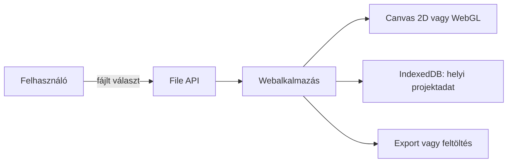
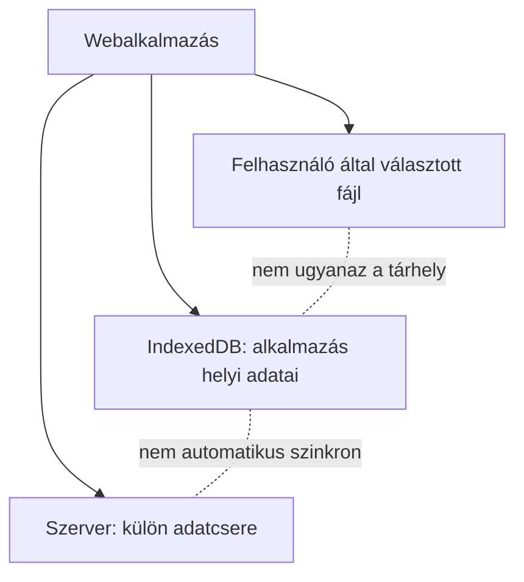

# A böngésző képességei és határai

A böngésző nemcsak HTML-t jelenít meg. Egy webalkalmazás rajzolhat kétdimenziós vagy térbeli képet, feldolgozhat a felhasználó által kiválasztott fájlt, helyben tárolhat adatot, lejátszhat médiát, és bizonyos eszközfunkciókat is kérhet. Mindez böngésző által közvetített API-kon keresztül történik: a weboldal nem kap korlátlan hozzáférést a számítógéphez. A különböző képességek célját és határát érdemes már most látni; a tárolás, az offline működés és a jogosultságok részletei később következnek.

## Egy böngészős szerkesztő többféle képességet használ

Egy hallgató böngészős ábraszerkesztőt nyit meg. Kiválaszt egy képfájlt a saját gépéről, módosítja, majd a munkát szeretné később folytatni. A szerkesztőnek fájlbeolvasásra, rajzolásra és helyi tárolásra lehet szüksége. Egy térbeli modellnézethez a grafikus hardvert használó WebGL is jól jöhet. Ezek a műveletek eltérő API-khoz és eltérő hozzáférési feltételekhez tartoznak; a „böngésző képes rá” önmagában nem mondja meg, hogyan működik az adott lépés.



Az ábra lehetséges felépítést mutat. A kijelölt helyi fájl beolvasása, a böngésző saját tárhelyén tárolt projekt és a szerverre történő feltöltés három külön művelet. Nem következik egyikből automatikusan a másik.

## Böngésző API: közvetített hozzáférés

A JavaScript a böngésző által kínált programozható felületeket használja. Egyes API-khoz felhasználói kezdeményezés kell, másoknál a böngésző kifejezett engedélyt kérhet, és vannak olyanok is, amelyek külön engedélykérés nélkül működnek. A feltételek API-nként eltérnek. Az alkalmazásnak ezért nemcsak a támogatottságot, hanem az esetleges elutasítást, hibát és rendelkezésre álló tartalék utat is kezelnie kell.

A böngésző API nem azonos a szerver által kínált webes API-val. Itt a böngésző által a weboldalnak nyújtott lehetőségekről beszélünk: például a fájlobjektum olvasásáról vagy a grafikus rajzolófelületről. A szerver és kliens közötti adatcsere a későbbi API-alkalom témája.

## Helyi fájlok: kiválasztás, olvasás, mentés

Az egyszerű és széles körben használt út a fájlválasztó vagy a drag and drop. A felhasználó kiválaszt egy fájlt; a **File API** ezután `File` objektumként hozzáférhetővé teheti a választott állományt az oldal számára. Az alkalmazás például beolvashat egy képet, megjelenítheti előnézetben, majd dönthet úgy, hogy csak helyben dolgozik vele, vagy külön művelettel feltölti. A kiválasztás nem jelent automatikus feltöltést, és a weboldal nem olvashatja ki tetszés szerint a felhasználó összes fájlját.

```html
<label for="forras">Válassz képet</label>
<input id="forras" type="file" accept="image/*">
```

A fenti HTML csak a választás felületét jelöli; a fájl további feldolgozásához programkód kell. Egyes böngészők további fájlrendszer-felületeket is kínálnak, amelyekkel a felhasználó által kiválasztott fájl vagy mappa olvasása és mentése is lehetséges. Ezek támogatottsága és használati feltételei eltérhetnek. Egy egyszerű fájlfeltöltést ezért nem célszerű feleslegesen egy fejlettebb fájlrendszer-API-hoz kötni.

## Helyi adattárolás: mire jó az IndexedDB?

A böngésző saját tárhelyén egy webalkalmazás adatokat tarthat meg későbbi látogatásokra. Az **IndexedDB** strukturált adatok tárolására alkalmas böngészős adatbázis-API. Az ábraszerkesztő például eltárolhatja egy félbehagyott munka elemeit és beállításait, hogy a felhasználó később folytathassa. Az adatok írása és olvasása tranzakciókon keresztül történik. Ez más feladat, mint egy, a felhasználó által kiválasztott helyi fájl közvetlen szerkesztése.

Az IndexedDB a webhely eredetéhez kötött tárhelyet használ; egy másik, idegen eredetű oldal nem egyszerűen olvassa ki belőle a projektet. A helyi tárolás azonban nem azonos a megbízható, korlátlan tartósságú biztonsági mentéssel. A rendelkezésre álló hely korlátozott lehet, az adatok törlődhetnek, és másik eszközön nem jelennek meg automatikusan. A fontos munka exportját vagy szerveres szinkronját külön kell megtervezni.

A `localStorage` egyszerű kulcs–érték tároló, míg az IndexedDB összetettebb, nagyobb strukturált adathalmazokhoz is használható. A `sessionStorage` jellemzően az adott böngészőlap munkamenetéhez kötődik. Ezen a héten elég a szerepkülönbséget felismerni; a tárhelykvóták, tranzakciók programozása, szinkron és offline architektúra későbbi elmélyítés tárgya. A cookie-t ne keverjük össze a böngészőoldali projektadattárral: más célra és más szabályok szerint működik, részletesen az állapotkezelésnél tárgyaljuk.



## Rajzolás: Canvas 2D és WebGL

A **Canvas 2D** programból rajzolt képekhez, egyszerű animációkhoz vagy diagramokhoz használható. A **WebGL** szintén egy `canvas` elemen belül működhet, de a grafikus hardverre támaszkodó, interaktív 2D és 3D megjelenítésre szolgáló API. Egy kurzusoldal statikus ábrájához gyakran elegendő a szemantikus HTML vagy egy könnyen értelmezhető diagram; egy térbeli modell forgatásához a WebGL indokoltabb lehet.

A WebGL támogatottsága mellett a konkrét eszköz grafikus képessége és a létrehozható grafikus kontextus is számít. A programnak ténylegesen ellenőriznie kell, sikerül-e WebGL-környezetet kapnia; ellenkező esetben biztosíthat egyszerűbb nézetet vagy szöveges leírást. A rajzolt képpontok önmagukban nem adják át a rajzolt objektumok jelentését a segítő technológiáknak. Ha a grafika információt hordoz, annak hozzáférhető alternatíváját is meg kell tervezni.

## Média, helyadat és értesítés

A HTML médiaelemei hang és videó lejátszására adnak felületet. A böngésző más API-kon keresztül a felhasználó helyadatait, kamera- vagy mikrofonhasználatot, illetve értesítések megjelenítését is támogathatja. Ezeknél különösen fontos, hogy a funkció célja világos legyen, és a felhasználó elutasítása után is értelmes állapot maradjon. Egy kurzusoldalhoz például rendszerint nincs szükség pontos földrajzi helyre; ha térképes funkciót kínál, a helyszín szöveges címe önállóan is legyen elérhető.

| Cél | Lehetséges böngészős képesség | Ha nem érhető el |
| --- | --- | --- |
| Kép megnyitása | Fájlválasztó és File API | Egyértelmű hibaüzenet vagy más beviteli mód |
| Munka folytatása később | IndexedDB | Export vagy szerveres mentés külön döntéssel |
| Interaktív térbeli ábra | WebGL | Egyszerűbb kép vagy szöveges leírás |
| Hang vagy videó | Médiaelem | A lényeges információ más formában is elérhető |
| Helyhez kötött találat | Helyadat-API | Kézi helymegadás |

## Elérhetőség, engedély és eredmény

Három külön kérdést tegyünk fel minden képességnél. Elérhető-e a szükséges API az adott böngészőben és környezetben? Teljesülnek-e a használat feltételei, például egy felhasználói fájlválasztás vagy engedély? Sikerült-e maga a művelet? WebGL esetén például az API neve létezhet, de a grafikus kontextus létrehozása meghiúsulhat. Helyadatnál az elutasítás vagy sikertelen mérés is normális kimenet.

A képesség megléte önmagában nem indok a használatára. A felhasználói cél, az adatkezelés és az alternatív út együtt határozza meg, hogy egy böngészőfunkció jó választás-e. A részletes jogosultsági modell, a cookie-k és az offline működést segítő service worker későbbi alkalmakon következnek; itt a böngésző mint programozható, de korlátos környezet a fő tanulság.

## Gyakori félreértések

| Állítás | Pontosítás |
| --- | --- |
| „Egy oldal tetszőleges helyi fájlt elolvashat.” | A felhasználói fájlválasztás vagy megfelelően biztosított hozzáférés határozza meg, melyik fájl érhető el. |
| „A fájl kiválasztása automatikus feltöltés.” | Az oldal helyben is feldolgozhatja; a szerverre küldés külön művelet. |
| „Az IndexedDB egy felhasználó által látható projektfájl.” | Az alkalmazás böngészőben tárolt, eredethez kötött adatbázisa. |
| „A helyi mentés biztos biztonsági másolat.” | A böngésző tárhelye korlátozott vagy törölhető lehet; export és szinkron külön feladat. |
| „A WebGL minden eszközön garantáltan működik.” | A tényleges grafikus környezet elérhetőségét ellenőrizni kell. |
| „Az API létezése biztos sikert jelent.” | A feltételek és a művelet eredménye külön kérdések. |
