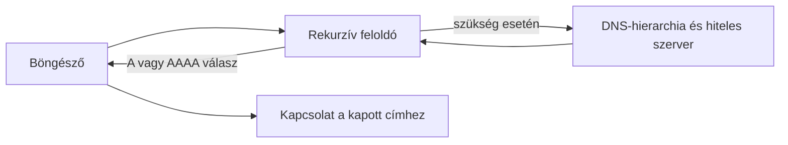

# Domainnév, IP-cím és DNS

A webcímben szereplő név a felhasználónak és a szolgáltatásnak is érthető azonosító, a hálózati kapcsolat felépítéséhez azonban elérhető végpontra van szükség. A DNS segít a névből a kapcsolat felépítéséhez használható hálózati címet megtalálni. Ez a lépés összeköti a korábban tanult URL-t a tényleges adatátvitellel.

## Egy név, amelyet a hálózatnak is értelmeznie kell

Egy hallgató megnyitja a `https://tananyag.example.edu/kurzusok` címet. A `tananyag.example.edu` hosztnév a szolgáltatást nevezi meg, de önmagában nem az a hálózati cím, amelyhez a kapcsolatot felépítjük. A böngészőnek a névhez egy vagy több IP-címet kell találnia. A `/kurzusok` útvonalat majd a webes szolgáltatás értelmezi; a DNS nem az egyes oldalakat vagy útvonalakat keresi meg.

Az IP-cím hálózati címzésre szolgál. Az IPv4 és az IPv6 eltérő címformátumok. Egy domainhez több cím is tartozhat, és a válasz helytől vagy időponttól függően változhat. Az IP-cím nem szükségképpen egyetlen fizikai szervert azonosít: lehet közvetítő vagy sok szerver közös belépési pontja. Fordítva is igaz, egy címen több webes név osztozhat.

## A névfeloldás fő szereplői

A Domain Name System, röviden DNS, elosztott és hierarchikus névrendszer. A kliens jellemzően egy beállított rekurzív feloldóhoz fordul. A feloldó, ha nincs nála érvényes válasz, a DNS-hierarchia segítségével keresi meg az adott névért felelős hiteles névszervert. Az autoritív névszerver a saját zónájának rekordjairól ad választ. A kliens ebből például `A` vagy `AAAA` rekordot kaphat, amelyek IPv4-, illetve IPv6-címet közölnek.

Az ábra egy lehetséges teljes feloldást mutat, nem minden megnyitás kötelező útját. A böngésző, az operációs rendszer vagy a feloldó korábbi eredményt is tárolhat; ilyenkor egyes külső lépések kimaradnak. Az is előfordulhat, hogy a feloldó közvetlenül rendelkezik érvényes válasszal.

## Gyorsítótár és változó válasz

A DNS-rekordokhoz kapcsolódó TTL az az időtartam, ameddig a válasz tárolható a megfelelő gyorsítótárban. Ez csökkentheti a késleltetést és a névszerverek terhelését. Ha viszont a szolgáltató megváltoztatja a címet, egyes feloldók egy ideig még korábbi, de a TTL szerint érvényes választ használhatnak. Ezért egy DNS-módosítás hatása nem feltétlenül jelenik meg mindenkinél egyszerre.

Egy nagy szolgáltatás több címet használhat terheléselosztásra vagy földrajzilag eltérő belépési pontokhoz. A DNS-válasz tehát nem állandó „egy név = egy gép” tábla. A hallgató számára ebből az a fontos, hogy a domain a szolgáltatás stabil neve lehet akkor is, ha a mögötte álló infrastruktúra változik.

## Mire ad és mire nem ad választ a DNS?

> [!note] A sikeres DNS-feloldás csak egy lépés
> A sikeres névfeloldás azt mutatja, hogy a névhez használható hálózati információt kaptunk. Nem bizonyítja, hogy a kiszolgáló elérhető, a TLS-kapcsolat létrejön vagy a kért oldal létezik. Ha a DNS nem tud választ adni, a böngésző még a HTTP-kérés előtt elakadhat. Ha a DNS-válasz megvan, de az oldal mégsem nyílik meg, a kapcsolat, a tanúsítvány vagy az alkalmazás más pontja is hibás lehet.

A DNS önmagában nem a webes tartalom hitelesítése. Egy hamis vagy hibás DNS-válasz rossz címhez vezethet; a későbbi HTTPS-tanúsítvány-ellenőrzés külön védelmi réteget jelent. A két feladatot nem szabad összekeverni: a DNS címet keres, a TLS a kapcsolat védelmében és a megnevezett szolgáltatás hitelesítésében vesz részt.

## Gyakori félreértések

| Állítás | Pontosítás |
| --- | --- |
| „A DNS megkeresi a weboldal fájlját.” | A névhez hálózati információt ad; az útvonalat a webes szolgáltatás értelmezi. |
| „Egy domainhez egyetlen, állandó IP-cím tartozik.” | Több cím és változó válasz is lehetséges. |
| „A sikeres DNS-válasz azt jelenti, hogy az oldal működik.” | A kapcsolat és a HTTP-kérés később is hibázhat. |
| „Minden megnyitáskor újra végig kell járni a teljes DNS-hierarchiát.” | Érvényes gyorsítótári válasz több lépést kiválthat. |
