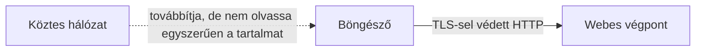

# Mit véd a HTTPS, és mit nem?

A `https://` kezdetű cím védett webes kapcsolatot jelez. A HTTPS a HTTP-üzeneteket TLS-védelemmel továbbítja: az átvitt tartalom titkosságát, sértetlenségét és a kiszolgáló ellenőrizhető azonosítását szolgálja. Ez nélkülözhetetlen, de nem minősíti a webhely szándékát vagy a rajta közzétett információ igazságát.

## Védett kapcsolat egy nyilvános hálózaton

Egy hallgató nyilvános Wi-Fi-n megnyit egy kurzusoldalt. A köztes hálózat továbbítja a forgalmat, ezért érdemes megkérdezni, mit láthat vagy változtathat meg. Ha a böngésző érvényes HTTPS-kapcsolatot épített a kívánt domainhez, a HTTP-kérés és a válasz tartalma TLS-védelem alatt halad. Egy útvonalon lévő kívülálló nem tudja egyszerűen elolvasni vagy észrevétlenül átírni ezt a tartalmat.

Az ábra nem teljes láthatatlanságot ígér. A kapcsolat léte, időzítése, mennyisége és egyes címzési adatok továbbra is megfigyelhetők lehetnek a hálózatban. Hogy pontosan milyen metaadat látszik, a használt protokolloktól és környezettől függ. A „titkosított” nem azt jelenti, hogy a felhasználó minden tevékenysége rejtve marad.

## Három védelmi tulajdonság

A **titkosság** az átvitt tartalom olvasása ellen véd. A **sértetlenség** azt segít ellenőrizni, hogy az üzenetet útközben nem módosították észrevétlenül. A **szerver hitelesítése** pedig a megadott domain és a kapcsolat másik végpontja közötti bizalmat építi fel a tanúsítvány ellenőrzésével. E három cél különbözik: a titkosítás önmagában nem volna elég, ha a böngésző nem tudná, kivel beszél.

A tanúsítvány a domainhez kötött kapcsolatot támasztja alá. Ha a felhasználó a rossz domainre érkezik, a böngésző ott is találhat érvényes tanúsítványt. Egy megtévesztő oldal tehát lehet technikailag HTTPS-védett a saját nevéhez, miközben adathalászatra használják. A felhasználónak az URL nevét és a szolgáltatás kontextusát is értelmeznie kell.

## A védelem határa

> [!warning] A HTTPS nem tanúsítja az alkalmazás minőségét
> A HTTPS a továbbítás védelme. Nem garantálja, hogy a szerver oldali alkalmazás hibamentes, a szolgáltató felelősen kezeli az adatokat, vagy a közölt információ igaz. A böngésző sem tudja egy tanúsítványból megállapítani, hogy egy jelentkezési oldal korrekt-e. A jelszó védett úton is eljuthat egy rosszindulatú szolgáltatáshoz, ha a felhasználó eleve annak oldalát nyitotta meg.

A védett főoldalhoz tartozó erőforrások szintén fontosak. Ha az oldal egy alerőforrást nem védett HTTP-n kérne, annak tartalma külön kockázatot jelenthet. A böngészők az ilyen vegyes tartalmat külön szabályok szerint kezelik. Fogalmi szinten az a tanulság, hogy a fő dokumentum HTTPS-je önmagában nem mentesít az oldal teljes erőforrásláncának vizsgálata alól.

## Mikor áll meg az út?

Ha a tanúsítvány nem érvényes a megnyitott domainre vagy más ellenőrzés hibázik, a böngésző figyelmeztethet, mielőtt a HTTP-választ elfogadná. Ez más típusú hiba, mint egy `404` vagy `500` státuszkód: utóbbiak már HTTP-válaszok. A különbség segít azonosítani, hogy a folyamat melyik pontján szakadt meg.

## Gyakori félreértések

| Állítás | Pontosítás |
| --- | --- |
| „A HTTPS-es oldal biztosan megbízható.” | A kapcsolat védelme nem bizonyítja a szolgáltató jó szándékát. |
| „A titkosítás minden hálózati adatot elrejt.” | A kapcsolat egyes metaadatai továbbra is láthatók lehetnek. |
| „A tanúsítvány a tartalom igazságát garantálja.” | A domainhez kötött kapcsolat ellenőrzésében segít. |
| „A tanúsítványhiba HTTP 404.” | A tanúsítvány ellenőrzése a HTTP-válasz előtt is megállíthatja a folyamatot. |
