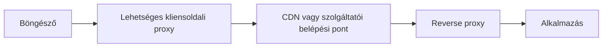

# Proxyk, reverse proxyk és CDN-ek

A webes kérés útjában nem feltétlenül csak a böngésző és egy alkalmazásszerver áll. Közvetítők fogadhatják, továbbíthatják, irányíthatják vagy gyorsítótárazhatják a forgalmat. A proxy, a reverse proxy és a CDN más-más nézőpontból érthető meg; szerepük ismerete nélkül könnyű a teljes rendszert egyetlen, láthatatlan „szervernek” hinni.

## Ugyanaz a kurzusoldal, több belső szereplő

Egy hallgató megnyitja a tananyagoldalt. A felületen egyetlen domain látszik, de a forgalmat intézményi kliensoldali proxy, szolgáltató oldali belépési pont és tartalomkézbesítő hálózat is érintheti. Nem mindegyik van jelen minden rendszerben. A közös elv az, hogy a közvetítő valamilyen céllal a kliens és a tényleges tartalomforrás között áll.

Az ábra lehetséges felépítés, nem kötelező sor minden oldalnál. Sok esetben a böngésző közvetlenül a szolgáltatói belépési ponthoz kapcsolódik. A CDN és a reverse proxy szerepe is összeérhet: egy CDN-szolgáltatás maga is fogadhat és továbbíthat kéréseket.

## Proxy a kliens oldalán

A **forward proxy**, hétköznapi szóhasználattal proxy, egy kliens vagy klienscsoport nevében kommunikálhat a távoli szolgáltatással. Egy szervezeti hálózat használhatja hozzáférés szabályozására, naplózásra vagy bizonyos tartalmak gyorsítótárazására. A böngésző a proxyhoz fordul, a proxy pedig szükség szerint továbbítja a kérést.

HTTPS esetén a köztes proxy nem olvassa automatikusan a TLS-sel védett tartalmat. A pontos láthatóság a kapcsolat felépítésétől és a szervezeti környezettől függ. A proxy puszta jelenléte tehát nem jelenti, hogy a védett HTTP-üzenet tartalma minden közvetítő számára nyitott.

## Reverse proxy a szolgáltató oldalán

A **reverse proxy** a webes szolgáltató külső belépési pontja lehet. Fogadja a böngésző kérését, majd belső szerverhez irányítja. Kezelhet TLS-kapcsolatot, eloszthatja a terhelést több alkalmazáspéldány között, és bizonyos válaszokat gyorsítótárazhat. A böngésző számára közben ugyanaz a nyilvános domain marad látható.

Például a `/kurzusok` útvonal mehet a kurzusalkalmazáshoz, a `/dokumentumok` egy fájlszolgáltatáshoz. Az ilyen irányítás üzemeltetési döntés. A reverse proxy nem garantálja, hogy a mögötte futó program hibamentes vagy biztonságos; csak a saját feladatain belül tud segíteni.

## CDN: elosztott tartalomkézbesítés

A **CDN** földrajzilag elosztott kiszolgálói hálózat. Gyakran képek, stíluslapok, programfájlok és más, sok felhasználó számára azonos erőforrások gyors kiszolgálására használják. A hálózathoz közelebb lévő belépési pont és a helyben tárolt válasz csökkentheti a késleltetést és az eredeti szerver terhelését. Ez feltételes előny: cache-találattól, elhelyezkedéstől, erőforrástól és hálózati úttól függ.

> [!warning] Eltérően gyorsítótárazd a nyilvános és személyes adatokat
> A gyorsítótárból adott válasz frissességét szabályok határozzák meg. Egy közös kurzuslogó sok felhasználónak azonos lehet; egy személyre szabott jelentkezési állapot nem kezelhető ugyanígy gondolkodás nélkül. A CDN szerepét ezért nem szabad a „minden választ gyorsan megad” állítássá egyszerűsíteni.

## Ki válaszolt ténylegesen?

Egy HTTP-válasz érkezhet az alkalmazástól, egy reverse proxy gyorsítótárából vagy egy CDN-csomóponttól. A böngésző a válasz tartalmát és státuszkódját látja; a belső út nem mindig állapítható meg pusztán a látható oldalból. A rendszer vizsgálatakor ezért a közvetítő rétegeknek is szerepet adunk. A következő fejezet a teljes utat egyetlen folyamatban követi végig.

## Gyakori félreértések

| Állítás | Pontosítás |
| --- | --- |
| „A proxy és a reverse proxy ugyanazt a felet képviseli.” | Az előbbi jellemzően a kliens, az utóbbi a szolgáltató oldalán áll. |
| „CDN esetén a válasz mindig gyorsítótárból jön.” | Cache-hiány vagy nem tárolható tartalom esetén az eredeti rendszerhez kell fordulni. |
| „Egy domain mögött egy szerver van.” | Közvetítők és több alkalmazáspéldány is állhat mögötte. |
| „A reverse proxy kijavítja az alkalmazás hibáját.” | Csak a saját közvetítési és üzemeltetési feladatait látja el. |
