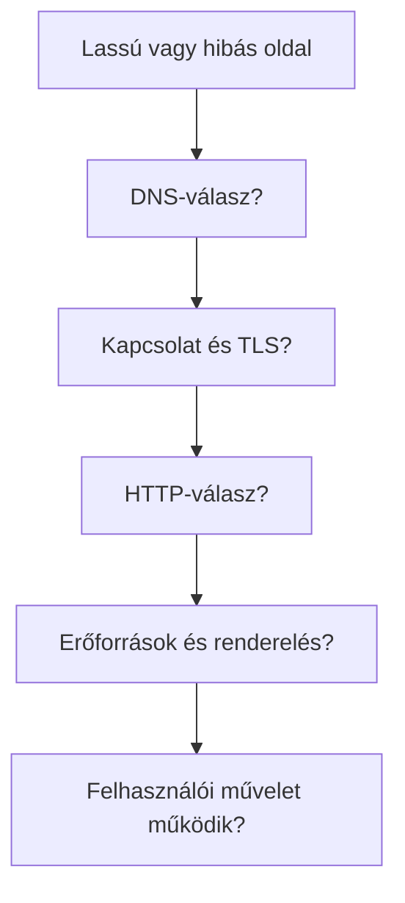

# Késleltetés és hibák a kérés útján

Amikor egy oldal lassú vagy nem nyílik meg, a „rossz az internet” nem elég pontos magyarázat. A névfeloldás, a kapcsolatépítés, a TLS, a szerver válasza, a további erőforrások és a böngésző munkája külön-külön okozhat késést vagy hibát. A folyamat rétegeinek ismerete lehetővé teszi, hogy a tünethez a megfelelő vizsgálati pontot válasszuk.

## Ugyanaz a tünet, eltérő ok

Egy hallgató megnyitná a kurzusoldalt, de sokáig üres képernyőt lát. Lehet, hogy a DNS-feloldás nem ad választ, a hálózati kapcsolat lassan jön létre, a szerver dolgozik sokáig, vagy a HTML már megérkezett, de a böngésző egy fontos stílusra vagy programra vár. A tünet hasonló, a megoldáshoz szükséges vizsgálat azonban más.

Az ábra nem automatikus döntési fa. A lépések részben átfedhetnek vagy párhuzamosan történhetnek. A sorrend arra jó, hogy elválasszuk a HTTP előtt, a válasz közben és a válasz utáni feldolgozás során keletkező problémákat.

## A késleltetés részei

A DNS-lekérdezés időt kérhet, ha nincs érvényes gyorsítótári válasz. A kapcsolat és a TLS-kézfogás több üzenetváltást igényelhet. A szerveroldalon az alkalmazás adatot kereshet vagy más szolgáltatásra várhat, mielőtt elküldi a választ. A hálózati átvitel nagy fájlnál hosszabb lehet, a böngésző pedig ezután is végezhet feldolgozást. Az összidő tehát nem egyetlen szám mögötti egyetlen ok.

Az időbeli szakaszok sem minden megnyitáskor adódnak egyszerűen össze. Néhány erőforrás párhuzamosan töltődik; egy korábbi kapcsolat vagy gyorsítótári válasz lépéseket takaríthat meg. Máskor egy erőforrás csak egy előző fájl feldolgozása után fedezhető fel. Ezért a konkrét oldal idővonalát kell vizsgálni, nem csupán általános szabályt felmondani.

## Hiba a HTTP előtt vagy után

> [!tip] Különítsd el a kapcsolati hibákat a HTTP-hibáktól
> Ha a DNS nem ad használható választ, a böngésző nem tudja felépíteni a kívánt kapcsolatot. Ha a TCP vagy TLS szakasz hibázik, szintén előfordulhat, hogy nem érkezik HTTP-státuszkód. A `404` ezzel szemben HTTP-válasz: a kérés eljutott egy válaszoló webes rendszerhez, de az adott erőforrást ott nem találták. Az `500` szintén HTTP-válasz, amely szerveroldali hibaosztályt jelöl.

Egy sikeres fő dokumentum mellett egy alerőforrás külön hibázhat. A hiányzó CSS-ről a Network panelben 404-es sor árulkodhat, miközben a HTML szövege megjelenik. Egy későn érkező kép a lap stabilitását ronthatja, egy nagy JavaScript-feladat pedig a felület reakcióját késleltetheti. A hibát ezért erőforrásonként és felhasználói hatás szerint is értelmezni kell.

## Vizsgálat a megfelelő helyen

A címet és a hosztnevet először érdemes ellenőrizni. Ha a kapcsolat létrejött, a Network panelen a fő dokumentum kérésének státusza, időzítése és tartalomtípusa ad támpontot. Ha a válasz megérkezett, az Elements nézet segít megnézni az aktuális dokumentumot és stílusokat. Végül a felhasználói művelet próbája jelzi, hogy a hiba ténylegesen akadályozza-e az oldal célját.

Egyetlen mérés nem általánosít minden felhasználóra. A hálózat, a hely, az eszköz, a gyorsítótár állapota és a szerver terhelése is változhat. A diagnózis ezért megfigyelésekre épülő következtetés, amelynél világosan meg kell mondani, melyik réteghez van bizonyíték és melyikhez nincs.

## Gyakori félreértések

| Állítás | Pontosítás |
| --- | --- |
| „Lassú oldal = lassú internet.” | A szerver és a böngésző munkája is késleltethet. |
| „A 404 azt jelenti, hogy nincs hálózat.” | A 404 már HTTP-válasz egy elért webes rendszertől. |
| „Ha a HTML 200-as, minden rendben.” | A további erőforrások vagy a felhasználói művelet hibázhatnak. |
| „Minden késés egymás után, ugyanabban a sorrendben adódik össze.” | Gyorsítótár, párhuzamosság és újrahasznált kapcsolat módosíthatja az idővonalat. |
