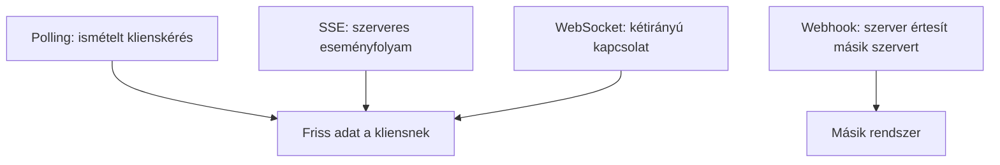

# Változó adatok: polling, SSE, WebSocket és webhook

Egyes adatokra elég egyszer rákérdezni, mások folyamatosan változnak. A kurzusjelentkezési férőhelyek, az élő eredmények vagy egy közös szerkesztés állapota frissítést igényelhet. A polling, a Server-Sent Events, a WebSocket és a webhook különböző irányú és idejű kommunikációs minták. A megfelelő megoldást az határozza meg, ki kezdeményez, milyen gyakran változik az adat, és szükség van-e kétirányú üzenetváltásra.

## Egy változó férőhelyszám

A hallgató egy kurzusoldalon azt látja, hogy még három hely maradt. Közben mások is jelentkezhetnek, így a szám változhat. Ha csak egyszer kérjük le az adatot, a felület hamar elavulhat. Több megoldás létezik, de egyik sem helyettesíti a szerver végső ellenőrzését: a „még van hely” kijelzés pillanatnyi információ, nem garantált foglalás.

Az ábra mutatja a négy minta irányát. A webhook nem ugyanazt a problémát oldja meg, mint a böngészőben látható férőhelyszám frissítése: jellemzően szolgáltatások közötti értesítés.

## Polling: időnként új kérés

**Polling** esetén a kliens meghatározott időközönként újra elkéri az adatot, például harminc másodpercenként a férőhelyszámot. Egyszerű HTTP-kérésekre épül, ezért könnyen kapcsolható egy már meglévő API-hoz. Hátránya, hogy akkor is kérdez, ha nem történt változás, és egy változás csak a következő lekéréskor jelenik meg. Ritkán változó adathoz ez elfogadható lehet; másodpercenkénti, sok kliensre kiterjedő frissítésnél már költséges lehet.

A lekérdezési gyakoriság nem puszta technikai konstans. A felhasználói igény, a szerver terhelése és az adat változásának sebessége együtt alakítja. Ha a kliens hibát kap, nem célszerű korlátlanul, azonnal újraküldeni ugyanazt a kérést.

## Server-Sent Events: szerverről a kliens felé

A **Server-Sent Events**, röviden SSE, olyan HTTP-alapú eseményfolyam, amelyben a szerver a megnyitott kapcsolaton később is küldhet üzeneteket a kliensnek. A böngészőben az `EventSource` API használható az események fogadására. Ez jó lehet például élő státusz vagy hírfolyam megjelenítésére, amikor a lényeges új adatok jellemzően szerverről a kliens felé haladnak.

Az SSE nem általános kétirányú beszélgetés ugyanazon a csatornán. Ha a kliens műveletet akar kezdeményezni, azt külön HTTP-kéréssel megteheti. A kapcsolat megszakadása és az újrakapcsolódás kezelésével is számolni kell. A választás előnye az egyszerűbb, egyirányú eseménymodell lehet, nem az, hogy minden esetben „valós idejűbb” bármely más megoldásnál.

## WebSocket: kétirányú üzenetek

A **WebSocket** tartós, kétirányú üzenetváltást tesz lehetővé a kliens és a szerver között. Akkor lehet indokolt, ha mindkét fél gyakran kezdeményez: például közös szerkesztésnél vagy interaktív játékban. A kapcsolat felépítése után nem kell minden kis üzenethez önálló, teljes HTTP-kérés–válasz ciklust indítani.

A kétirányúság több állapotkezelést is jelent. A szervernek kezelnie kell a nyitott kapcsolatokat, a kliensnek a megszakadást, újrakapcsolódást és a kihagyott változásokat. Egy ritkán frissülő kurzuslista számára a WebSocket túlzás lehet. A technológia választása a kommunikáció igényéből induljon, ne abból, hogy a „valós idejű” címke korszerűen hangzik.

## Webhook: rendszer értesít rendszert

A **webhook** esetén egy szolgáltatás esemény bekövetkezésekor HTTP-kérést küld egy másik szolgáltatás előre megadott címére. Például a jelentkezési rendszer értesítheti a statisztikai rendszert egy új jelentkezésről. A fogadó szolgáltatásnak ellenőriznie kell, hogy az értesítés valóban a várt feladótól jön-e, és kezelnie kell az ismételt vagy sikertelen kézbesítést. A részletes biztonsági megoldások későbbi témák.

> [!note] A webhook és a WebSocket eltérő problémákat old meg
> A webhook tehát nem egyszerűen „WebSocket szerverek között”. Nem tartós, kétirányú csatorna, hanem eseményhez kötött, szolgáltatások közötti kérés. Ha a cél közvetlen böngészős frissítés, más út vagy további közvetítő lépés kellhet.

## Gyakori félreértések

| Állítás | Pontosítás |
| --- | --- |
| „Valós idejű frissítéshez mindig WebSocket kell.” | Polling vagy SSE is megfelelhet az igénynek. |
| „SSE-ben mindkét fél ugyanazon a csatornán küld eseményt.” | Az SSE szervertől kliens felé tartó eseményfolyam. |
| „A webhook a böngésző értesítése.” | Jellemzően szolgáltatás küld HTTP-kérést másik szolgáltatásnak. |
| „A kijelzett szabad hely biztos foglalás.” | A szervernek a jelentkezés pillanatában külön ellenőriznie kell az állapotot. |
