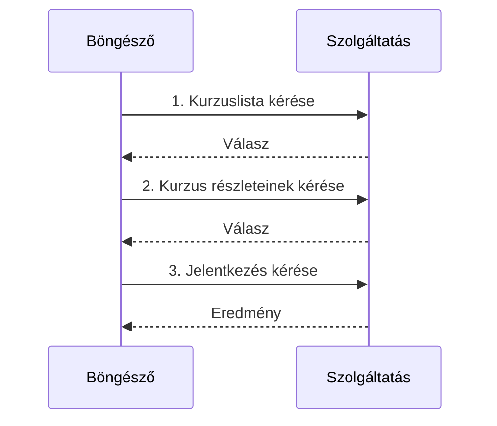

# Állapotmentes HTTP és alkalmazási állapot

A HTTP-kérés önálló üzenet: a protokoll nem őrzi meg automatikusan, ki küldte az előző kérést és milyen műveletet végzett. A webalkalmazásnak mégis gyakran szüksége van folytonosságra. A kurzusfelvételi felületen ugyanannak a hallgatónak több oldalon át kell látnia a választásait. Ezt az állapotot alkalmazási megoldások kötik össze az egymástól különálló kérésekkel.

## Egy hallgató több kérése

A hallgató megnyitja a kurzuslistát, kiválaszt egy tárgyat, majd a jelentkezési oldalra lép. A szerver három külön HTTP-kérést lát. A metódus, URL, fejlécek és esetleges törzs mindegyiknél külön érkezik. A HTTP önmagában nem kapcsolja őket egyetlen személyhez vagy jelentkezési folyamathoz. A szolgáltatásnak valamilyen azonosítót és tárolt állapotot kell felhasználnia ahhoz, hogy a megfelelő hallgató korábbi választásait újra elővegye.

Az ábra időbeli sorrendet mutat, nem közös, automatikus HTTP-memóriát. A három kérés összekötéséhez külön állapotkezelési mechanizmus szükséges.

## Mit jelent az állapotmentesség?

A protokoll állapotmentessége azt jelenti, hogy az egyes kérések értelmezéséhez nem jár automatikus, korábbi kérésekből örökölt beszélgetésállapot. Ez nem jelenti azt, hogy a szerver nem tárolhat adatbázist, vagy hogy a weben nem lehet bejelentkezni. A webes szolgáltatás az üzenetekben hordozott azonosítók és saját adattárolása révén tud folytonosságot létrehozni.

Az előző heti REST-fejezetben az állapotmentes kérés architekturális elvként is szerepelt: a kérés hordozza az értelmezéséhez szükséges kontextust, ne egy korábbi beszélgetés rejtett lépésére épüljön. Itt az alkalmazás felhasználói állapotát vizsgáljuk. A kettő összefügg, de nem azonos azzal az állítással, hogy „sehol nincs állapot”.

## Hol élhet az állapot?

A böngészőben lehet pillanatnyi felületi állapot: keresési szűrő, nyitott panel, beírt űrlapadat. Egy része az URL-ben is kifejezhető, így megosztható és visszakereshető. A böngésző helyi tárhelye későbbi látogatásra is megőrizhet adatot. A szerver ezzel szemben a jelentkezés tényleges eredményét és a hallgatóhoz tartozó jogosultságokat kezeli. Nem minden állapotot ugyanoda kell tenni.

| Állapot | Természetes hely | Miért? |
| --- | --- | --- |
| Kurzuslista szűrője | URL vagy kliens | Megosztható vagy pillanatnyi felületi adat |
| Megnyitott panel | Kliens memóriája | Rövid életű nézetállapot |
| Félbehagyott helyi vázlat | Böngészős tárolás, ha indokolt | Későbbi folytatás |
| Elfogadott jelentkezés | Szerver | Hivatalos, több felhasználót érintő adat |

## Folytonosság és azonosító

Egy szolgáltatás az egymást követő kérésekben szereplő munkamenet-azonosító alapján találhatja meg a szerveroldalon tárolt állapotot. Az azonosító jöhet például cookie-val. Más API-k hozzáférési tokent fogadnak. Az azonosító önmagában nem azonos a felhasználó nevével, és nem célszerű beleírni minden személyes adatot. A következő fejezet a cookie és munkamenet kapcsolatát részletezi.

A felület által mutatott állapot és a szerver hivatalos állapota eltérhet. Ha két hallgató egyszerre próbálja elfoglalni az utolsó helyet, a szervernek a jelentkezés feldolgozásakor kell eldöntenie, ki sikeres. A böngésző korábban látott férőhelyszáma csak pillanatnyi információ.

## Gyakori félreértések

| Állítás | Pontosítás |
| --- | --- |
| „Állapotmentes HTTP mellett nem lehet bejelentkezés.” | Cookie, token és szerveroldali munkamenet összekötheti a kéréseket. |
| „A szerver nem tárol adatot, ha a HTTP állapotmentes.” | A protokoll üzenete és az alkalmazás adattárolása külön fogalom. |
| „A kliens által látott férőhely a végleges igazság.” | A szerver a művelet pillanatában dönt az aktuális állapotról. |
