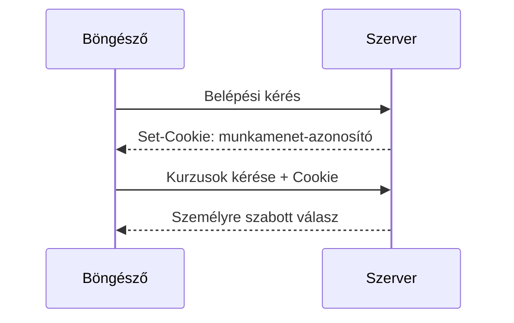

# Cookie-k és szerveroldali munkamenetek

A cookie kis adat, amelyet a böngésző a hozzá tartozó szabályok szerint tárolhat, és későbbi HTTP-kérésekhez csatolhat. Gyakori használata a munkamenet-azonosító továbbítása: a szerver ennek alapján találja meg, melyik bejelentkezett felhasználóhoz tartozik a kérés. A cookie azonban nem maga a teljes munkamenet, és nem automatikusan biztonságos attól, hogy kicsi.

## Bejelentkezés után új kérés

A hallgató belép a kurzusrendszerbe. A szerver ellenőrzi a bejelentkezést, létrehoz egy munkamenetet, majd a válasz `Set-Cookie` fejlécében azonosítót küldhet a böngészőnek. Egy későbbi kurzuslista-kérésnél a böngésző a vonatkozó cookie-t `Cookie` kérésfejlécben továbbítja. A szerver az azonosító alapján keresi meg a munkamenetet, és eldönti, milyen személyes adatot és műveletet adhat a hallgatónak.

Ez lehetséges minta, nem minden webalkalmazás kötelező megoldása. A cookie-ban célszerű csak a szükséges azonosítót tartani, a részletes munkamenetállapotot a szerver kezelheti. A konkrét biztonsági beállítások és támadási modellek a következő heti webbiztonsági fejezethez tartoznak.

## Cookie és munkamenet különbsége

A cookie a böngésző és a szerver közötti továbbítás eszköze. A szerveroldali munkamenet az alkalmazás által kezelt állapot, amelyet az azonosítóval keresünk meg. Ha a szerver érvényteleníti a munkamenetet, a böngészőben maradó régi azonosító nem adhat újra hozzáférést. Ha a böngésző elveszíti a cookie-t, a szerver nem tudja ugyanazzal az azonosítóval összekapcsolni a következő kérést.

A cookie-k más célra is használhatók, például nyelvi beállítás megjegyzésére. Ez azonban nem jelenti, hogy minden helyi alkalmazásadatot cookie-ban kell tárolni. A cookie-k a megfelelő kérésekhez elküldődnek, ezért nagy vagy összetett helyi adatokhoz a böngészős tárolófelületek célszerűbbek lehetnek.

## A cookie hatóköre és jellemzői

A cookie elküldését több beállítás befolyásolja, például a domain, az útvonal, a lejárat és a biztonsági attribútumok. A `Secure` azt jelzi, hogy a cookie csak megfelelően védett kapcsolaton küldhető. A `HttpOnly` a JavaScriptből való közvetlen olvasást korlátozza. A `SameSite` a más webhelyről induló kérésekhez kapcsolódó küldést szabályozza. Ezek nem a cookie tartalmának jelentését, hanem a kezelésének feltételeit alakítják.

A böngésző nem csatolja minden cookie-ját minden internetes kéréshez. A hatókör és az attribútumok határozzák meg, melyik kéréshez illik. A pontos szabályokat és a kapcsolódó támadási kockázatokat a következő alkalom részletezi; itt a munkamenet összekapcsolásához szükséges alapmechanizmus a fontos.

## Életciklus és kijelentkezés

A munkamenet nem tarthat örökké feltétel nélkül. Lejárhat, a felhasználó kijelentkezhet, vagy a szerver biztonsági okból megszüntetheti. A kijelentkezésnek ezért nemcsak a felületet kell „belépés nélkülinek” mutatnia, hanem a szerveroldali hozzáférést is érvénytelenítenie kell. A cookie törlése vagy lejárata része lehet ennek, de a szerver ellenőrzése döntő.

## Gyakori félreértések

| Állítás | Pontosítás |
| --- | --- |
| „A cookie maga a teljes munkamenet.” | Gyakran csak az azonosítót hordozza; az állapotot a szerver kezeli. |
| „A böngésző minden cookie-t minden kéréshez elküld.” | A hatókör és attribútumok korlátozzák a küldést. |
| „A kijelentkezés csak a gomb feliratának cseréje.” | A szerveroldali hozzáférést is meg kell szüntetni. |
| „Minden helyi adatot cookie-ban kell tárolni.” | Böngészős tárolófelületek más célra alkalmasabbak. |
