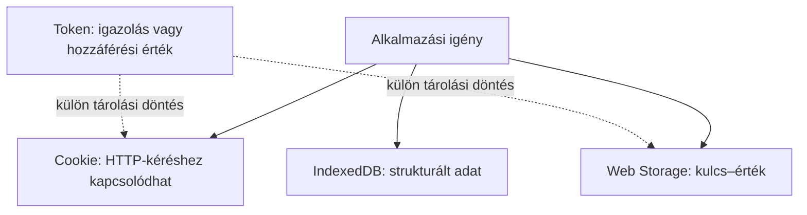

# Böngészős tárolás és tokenek

A böngésző többféle adatot őrizhet: cookie-t, kulcs–érték párokat és strukturált helyi adatbázist. A token ezzel szemben nem tárolási hely, hanem egy hozzáféréshez vagy azonosításhoz kapcsolódó érték, amelyet a megfelelő fél ellenőrizhet. A két fogalom összekeverése hibás döntésekhez vezethet: egy token tárolható különböző helyeken, de ettől még nem válik ugyanazzá, mint a tárhely.

## Kurzusoldal, vázlat és hozzáférés

A hallgató nyelvi beállítást választ, félbehagy egy helyi kurzustervezési vázlatot, és bejelentkezik a rendszerbe. A három adat eltérő célú. Egy kis beállítás cookie-ban vagy helyi kulcs–érték tárolóban is megjelenhet a tervezéstől függően. A vázlat strukturált, nagyobb adat lehet, amelyhez IndexedDB illik. A bejelentkezéshez kapcsolódó munkamenet vagy hozzáférési token viszont érzékeny azonosító, amelynek kezelését biztonsági szempontok határozzák meg.

Az ábra nem javasolja, hogy érzékeny tokent automatikusan Web Storage-ban tároljunk. Csak azt mutatja, hogy a token fogalma és a tárolás helye külön döntés. A konkrét védelmi megoldások a webbiztonsági alkalomhoz tartoznak.

## Web Storage és IndexedDB

A `localStorage` egyszerű, eredethez kötött kulcs–érték tároló, amely a böngésző későbbi használatakor is elérhető lehet. A `sessionStorage` hasonló felület, de az adott böngészőlap munkamenetéhez kötött. Az IndexedDB összetettebb, strukturált adatokhoz használható. Ezeket a böngésző nem csatolja automatikusan minden HTTP-kéréshez úgy, mint a vonatkozó cookie-kat. A tárolt adatok elérhetősége a böngésző beállításaitól és törlési döntéseitől is függ.

A helyi tárolás nem megbízható szerveroldali nyilvántartás és nem automatikus szinkron a felhasználó többi eszközére. Egy elfogadott jelentkezés hivatalos állapotát a szervernek kell kezelnie, nem elegendő a böngészőben eltárolni, hogy „sikeres”.

## Mi a token?

A token olyan érték, amelyet egy protokoll meghatározott célra ad át és ellenőriz. Egy hozzáférési token például egy API-erőforráshoz való hozzáférést képviselhet. A szerveroldali munkamenet-azonosító is hordozó érték, de más mechanizmushoz kapcsolódik. Nem minden token JWT, és egy JWT sem automatikusan biztonságos vagy alkalmas minden feladatra. A formátum és az érvényesség ellenőrzése külön kérdés.

Egy hozzáférési token lehet átláthatatlan karakterlánc vagy meghatározott szerkezetű. A kliens számára sok esetben nem a token belső tartalmának olvasása a feladat, hanem annak megfelelő továbbítása a jogosult erőforrás-szerver felé. A token jogosulatlan megszerzése visszaélésre adhat lehetőséget, ezért a tárolás, élettartam és továbbítás védelme fontos. Részletes védelmi szabályok a következő alkalom témái.

## Cookie, munkamenet és token együtt

Egy webhely küldhet cookie-ban szerveroldali munkamenet-azonosítót. Egy API elfogadhat hozzáférési tokent a HTTP `Authorization` fejlécben. OAuth 2.0 és OpenID Connect környezetben többféle token jelenhet meg, eltérő célra. A „cookie vagy token” tehát hamis, túl egyszerű választás: a cookie továbbítási/tárolási mechanizmus, a token pedig protokollbeli érték lehet. A megfelelő megoldást a kliens típusa, a hozzáférési határ és a biztonsági modell határozza meg.

## Gyakori félreértések

| Állítás | Pontosítás |
| --- | --- |
| „A token egy böngészős tárhely neve.” | Érték; tárolása külön tervezési döntés. |
| „Minden token JWT.” | Több formátum, köztük átláthatatlan token is létezik. |
| „A localStorage adatai automatikusan mennek a szervernek.” | A cookie-val ellentétben nem csatolódnak automatikusan a kérésekhez. |
| „A böngészőben tárolt sikeres jelentkezés a hivatalos eredmény.” | Az alkalmazás szerveroldali állapota a mérvadó. |
