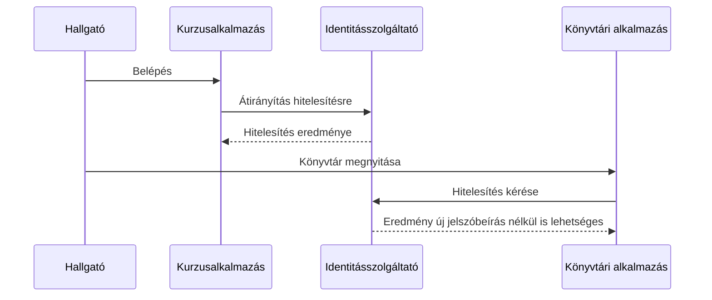

# Egyszeri és külső szolgáltatós bejelentkezés

Ha egy egyetem több rendszert használ, a hallgató számára kényelmes lehet egy közös identitásszolgáltató. Az egyszeri bejelentkezés, vagyis SSO azt a felhasználói élményt célozza, hogy a már igazolt identitás több kapcsolódó alkalmazásba való belépéshez felhasználható. A külső szolgáltatóval történő bejelentkezés hasonló átirányításokra épülhet, de más szervezet identitásszolgáltatóját vonja be. A helyi jogosultságokat egyik sem oldja meg automatikusan.

## Egyetemi portál, könyvtár és kurzusrendszer

A hallgató először a kurzusrendszerbe lépne be. A rendszer az egyetemi identitásszolgáltatóhoz irányítja, ahol igazolja magát. Az identitásszolgáltató megfelelő eredményt ad vissza, a kurzusrendszer pedig saját munkamenetet hoz létre. Később a hallgató a könyvtári rendszerre lép. Az is ugyanahhoz az identitásszolgáltatóhoz fordulhat; ha ott a felhasználónak még érvényes bejelentkezési állapota van, új jelszóbeírás nélkül folytathatja a folyamatot.

Az ábra fogalmi SSO-folyamat. Nem azt jelenti, hogy a két alkalmazás egymás cookie-ját olvassa. Mindkettő a közös identitásszolgáltatóval áll kapcsolatban, és külön saját munkamenetet tarthat fenn. Ha a központi bejelentkezés lejárt vagy további ellenőrzés kell, a hallgatónak újra igazolnia kell magát.

## Mit nyújt az SSO?

Az egyszeri bejelentkezés csökkentheti az ismételt jelszóbeírásokat, és központi helyre szervezheti az identitás ellenőrzését. Ez nem feltétlenül jelent egyetlen, minden alkalmazásban közös munkamenetet. A kurzusrendszer és a könyvtár saját hozzáférési szabályokat, munkamenet-időtartamot és kijelentkezési működést is használhat. Az identitásszolgáltató azt segít megállapítani, ki a felhasználó; a helyi rendszer dönti el, mit tehet.

Az SSO előnye mellett függést is teremt. Ha a központi identitásszolgáltató nem elérhető, új bejelentkezések akadályozottak lehetnek. A közös azonosítás biztonsági szempontból is jelentős, ezért a hitelesítés és munkamenet védelmére külön figyelmet kell fordítani. A részletes védelmi módszerek a következő heti anyaghoz tartoznak.

## Külső szolgáltatóval való belépés

Egy webhely felkínálhatja, hogy a felhasználó egy másik szervezet identitásszolgáltatójánál jelentkezzen be. A felhasználó átirányítással jut a szolgáltatóhoz, ott igazolja magát, majd az alkalmazás ellenőrizhető identitásinformációt kap. Erre tipikus szabványos keret az OpenID Connect. A helyi alkalmazás ezután saját felhasználói rekordot és munkamenetet kapcsolhat az identitáshoz.

A külső szolgáltató nem kap automatikusan jogot az alkalmazás összes adatára, és az alkalmazás sem ismeri meg szükségképpen a felhasználó külső jelszavát. Ugyanakkor a felhasználónak tudnia kell, melyik szolgáltatóhoz irányítják, milyen adatokat kap az alkalmazás, és hogyan kapcsolódik a külső identitás a helyi fiókjához. Az adatkezelési kérdések külön mérlegelést igényelnek.

## Bejelentkezés, kijelentkezés, hozzáférés

Az identitásszolgáltatónál történő sikeres belépés után a kurzusrendszernek a saját API-kéréseit is ellenőriznie kell. Egy hallgató nem szerkeszthet tanári kurzust csak azért, mert a közös belépés sikerült. A kijelentkezés sem mindig egyetlen gombbal szüntet meg minden központi és helyi munkamenetet; a pontos felhasználói élmény a rendszerek megállapodásától függ. A felületnek ezért világosan jeleznie kell, melyik alkalmazásból léptünk ki.

## Gyakori félreértések

| Állítás | Pontosítás |
| --- | --- |
| „SSO esetén az alkalmazások egymás cookie-ját használják.” | Közös identitásszolgáltatóra támaszkodhatnak, saját munkamenetekkel. |
| „Egyszeri belépés = minden alkalmazásban ugyanaz a jogosultság.” | A helyi jogosultságok külön döntések. |
| „Külső belépéskor az alkalmazás megkapja a külső jelszót.” | Szabványos átirányításos folyamatban a jelszó a szolgáltatónál marad. |
| „Egy kijelentkezés biztosan minden munkamenetet megszüntet.” | A központi és helyi munkamenetek élettartama eltérhet. |
