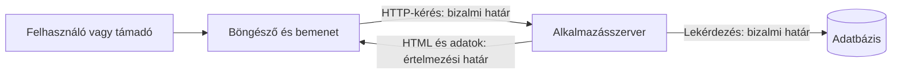

# Fenyegetési modell és bizalmi határok

A webbiztonság kiindulópontja nem egy támadásnév megtanulása, hanem annak tisztázása, hogy mit védünk, kitől és hol lép át egy adat bizalmi határt. Ugyanaz a webalkalmazás más kockázatokat hordoz egy nyilvános cikk megjelenítésekor és egy hallgatói jelentkezés módosításakor.

## Mit próbálunk megvédeni?

Egy egyetemi kurzusrendszerben védendő érték a hallgató személyes adata, a jelentkezések helyessége, a bejelentkezett munkamenet és maga a szolgáltatás elérhetősége. A támadó lehet külső látogató, másik bejelentkezett hallgató, rosszindulatú weboldal vagy egy ellopott fiókot használó személy. A biztonsági kérdés mindig egy konkrét képességhez kapcsolódik: a támadó el tud-e olvasni egy választ, rá tud-e venni egy böngészőt kérés küldésére, vagy el tud-e érni egy szerveroldali műveletet.

A fenyegetési modell rövid leírása annak, hogy milyen értékek, szereplők, lehetséges támadói képességek és védelmi feltételek fontosak. Nem jóslat minden jövőbeli támadásról. Segít rangsorolni azokat az ellenőrzéseket, amelyeket az alkalmazás tényleges működése igényel.

## A bizalmi határok átlépése

A felhasználói bemenet nem válik megbízhatóvá attól, hogy a saját alkalmazás űrlapjáról érkezett. A böngészőben futó kód és a hálózati kérés módosítható, az API közvetlenül is hívható. A szervernek ezért a módosító műveletnél újra ellenőriznie kell a felhasználót, a jogosultságát és a bemenetet. Az adatbázis felé küldött lekérdezés vagy egy másik felhasználónak megjelenített szöveg szintén új értelmezési környezet.

A határ nem azt jelenti, hogy a másik fél biztosan rosszindulatú. Azt jelenti, hogy a fogadó fél nem hagyatkozhat kizárólag a küldő korábbi állítására. A szerver például nem fogadhatja el a kérésben szereplő `studentId` mezőt annak bizonyítékaként, hogy a hallgató a saját jelentkezését módosítja.

## Egyszerű gondolatmenet egy művelethez

Tegyük fel, hogy a hallgató egy kurzusra jelentkezik. Először megnevezzük az értéket: a jelentkezések helyességét. Ezután a műveletet: a szerver egy adott hallgatót egy kurzushoz rendel. A fenyegetés például az, hogy más hallgató nevében érkezik kérés, vagy a böngésző egy idegen webhely hatására küldi el a bejelentkezett cookie-val. A védelem több külön döntésből áll: hitelesítés, műveletenkénti jogosultságellenőrzés, kérés eredetének megfelelő védelme, a bemenet és az adatbázis-művelet helyes kezelése.

Egyetlen védelem nem váltja ki a többit. A titkosított kapcsolat nem dönti el, hogy az adott felhasználó jelentkezhet-e a kurzusra. A bejelentkezés sem bizonyítja, hogy a kérés a hallgató szándékából indult.

## Gyakori félreértések

| Állítás | Pontosítás |
| --- | --- |
| „Csak a bejelentkezési oldal biztonságérzékeny.” | A személyes adatok olvasása és az állapotváltoztató műveletek is azok. |
| „A saját űrlapunkról érkező adat megbízható.” | A kérést a kliens vagy más program tetszőlegesen módosíthatja. |
| „A biztonság egyetlen kapcsoló.” | Több határon külön ellenőrzések szükségesek. |
