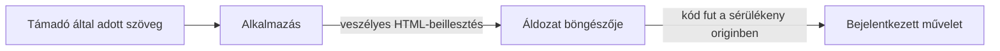
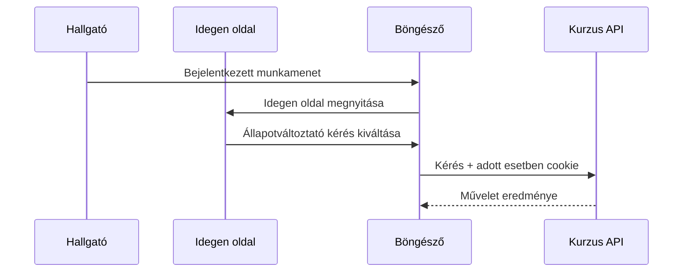
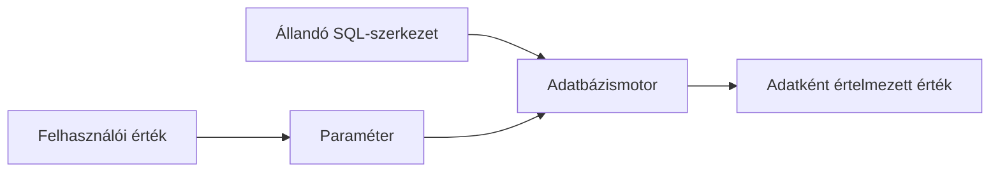

# XSS, CSRF és injekció

Három gyakori támadási család három külön határt sért: az XSS idegen tartalmat futtatható kódként juttat egy weboldalba; a CSRF egy bejelentkezett böngészőt nem szándékolt műveletre használ; az injekció pedig adatot értelmeztet utasításként egy másik rendszerrel. A védelemhez először azt kell látni, ki értelmezi újra az adatot, és milyen jogosultsággal.

## XSS: adatból végrehajtható tartalom

Egy fórumhozzászólásban a hallgató szöveget adhat meg. Ha a webalkalmazás a szöveget ellenőrizetlenül HTML-ként építi be az oldalba, a böngésző a támadó által adott részt kódként értelmezheti. A támadó kódja a sérülékeny oldal eredetében fut, ezért a felhasználó nevében látható tartalmat olvashat vagy műveletet kezdeményezhet. A `HttpOnly` cookie-t közvetlenül nem olvashatja, de ettől még a bejelentkezett böngésző nevében kérhet érzékeny műveleteket.

A tárolt XSS-nél a rosszindulatú tartalom a szerveren megmarad, és később másoknak is megjelenik. A visszatükrözött XSS-nél a kérésből vett adat veszélyesen kerül a válaszba. DOM-alapú XSS-nél a kliensoldali kód helyez adatot veszélyes DOM-környezetbe. Közös okuk a **szöveg és futtatható tartalom határának** elvesztése.

Az alapvédelem a kimeneti környezetnek megfelelő kódolás és biztonságos DOM API használata: felhasználói szöveget szövegként illesszünk be, ne HTML-ként. Ha valóban engedélyezett formázott HTML-t kell fogadni, erre alkalmas HTML-tisztítás szükséges. A Content Security Policy kiegészítő védelem lehet, de nem pótolja a helyes adatkezelést.

## CSRF: kérés egy másik oldal hatására

A hallgató be van jelentkezve a kurzusrendszerbe, majd meglátogat egy idegen webhelyet. Az idegen oldal olyan kérést indíthat, amelynél a böngésző bizonyos feltételek mellett a kurzusrendszer cookie-ját is csatolja. Ha a kurzusrendszer csak a cookie jelenlétét vizsgálja, egy állapotváltoztató műveletet tévesen a hallgató szándékának tekinthet. Az idegen oldalnak ehhez nem feltétlenül kell elolvasnia a választ; a mellékhatás a lényeg.

Az állapotváltoztató kérésekhez használható egy kiszámíthatatlan, szerver által ellenőrzött CSRF-token. A `SameSite` cookie-beállítás, az `Origin` vagy `Referer` megfelelő ellenőrzése és a csak olvasásra szánt `GET` szabályos használata további védelmi réteg. A pontos védelem az alkalmazás kérésmintájától függ. A CORS olvasási engedélyei nem helyettesítik a CSRF-védelmet. Ha az alkalmazás XSS-sel sérülékeny, a támadó a saját eredeten belül több CSRF-védelmet is megkerülhet.

## Injekció: adatból utasítás

Tegyük fel, hogy a szerver a kurzusazonosítót szöveg-összefűzéssel teszi egy SQL-lekérdezésbe. Ha a bemenet a lekérdezés szintaxisának részévé válik, a támadó megváltoztathatja a lekérdezés jelentését. Ugyanez az elv más értelmezőkben is előfordulhat, például parancsértelmező vagy sablonmotor esetén. Nem a furcsa karakter önmagában a probléma, hanem a **kód és adat összekeverése**.

> [!tip] Válaszd szét az SQL-utasítást és az értékeket
> Paraméterezett lekérdezésnél az SQL-szerkezet és a felhasználói érték külön kerül átadásra. A bemenet validálása szükséges lehet az üzleti szabályokhoz, de önmagában nem helyettesíti a paraméterezést. A szerver adatbázis-jogosultságait is a szükséges műveletekre kell korlátozni.

## A három támadás összevetése

| Támadás | Hol vész el a határ? | Első védelmi gondolat |
| --- | --- | --- |
| XSS | Felhasználói adatból böngészőben futó kód lesz. | Környezetfüggő kimeneti kódolás, biztonságos DOM-kezelés. |
| CSRF | Az idegen oldal által kiváltott kérés saját szándéknak látszik. | Kérés szándékának ellenőrzése, CSRF-token, cookie-szabályok. |
| SQL-injekció | Bemenet az adatbázis-utasítás szerkezetévé válik. | Paraméterezett lekérdezés. |

## Gyakori félreértések

| Állítás | Pontosítás |
| --- | --- |
| „A `HttpOnly` minden XSS-kárt megakadályoz.” | A cookie olvasását korlátozza, a sérült oldalon futó kód más műveletekre képes lehet. |
| „A CORS megakadályozza a CSRF-et.” | A CORS főként a válasz böngészős olvasását szabályozza. |
| „Elég minden különleges karaktert törölni.” | A helyes kezelés az értelmezési környezettől függ; SQL-nél paraméterezés kell. |
