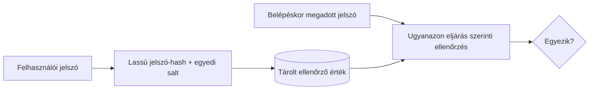

# Jelszavak, többfaktoros hitelesítés és munkamenetvédelem

A bejelentkezés biztonsága nem ér véget a jelszó helyes ellenőrzésével. A jelszó tárolása, a második faktor, a munkamenet-azonosító kezelése és a kijelentkezés együtt határozza meg, mennyire könnyű egy fiókot átvenni.

## Jelszó ellenőrzése és tárolása

Belépéskor a szerver összeveti a megadott jelszót a korábban tárolt ellenőrző értékkel. A jelszót nem szabad olvasható formában tárolni, mert egy adatbázis-szivárgás azonnal felfedné. A gyors, általános célú hash, például a sima SHA-256 sem megfelelő jelszótárolási megoldás: a támadó sok próbálkozást tud gyorsan elvégezni. Kifejezetten jelszavakhoz készült, költséges eljárás szükséges, például Argon2id, vagy megfelelő beállítással bcrypt/PBKDF2. Az egyedi salt segít abban, hogy az azonos jelszavak tárolt értékei eltérjenek.

A felhasználó számára a hosszú, egyedi jelszó és jelszókezelő hasznos. A szerveroldalon a túl sok próbálkozás kezelése, az incidensek észlelése és a biztonságos visszaállítási folyamat is fontos. A jelszó-visszaállítás gyakran ugyanúgy fiókátvételi út lehet, mint a bejelentkezés.

## Többfaktoros hitelesítés

Az MFA legalább két külön tényezőcsaládot kombinál: valamit, amit tudunk (például jelszó), birtoklunk (például hitelesítő eszköz) vagy ami a személyhez kapcsolódik. Két egymás után kért jelszó nem két faktor. Az MFA csökkenti egy ellopott jelszó értékét, de nem teszi lehetetlenné a fiókátvételt: adathalászat, munkamenetlopás vagy rosszul védett helyreállítás továbbra is kockázat.

A hitelesítő alkalmazás egyszer használatos kódja és a biztonsági kulcs eltérő tulajdonságú. Az adathalászattal szemben ellenálló, originhez kötött módszerek erősebb védelmet adhatnak. A kurzus szempontjából a lényeg az, hogy a faktor valóban önálló bizonyíték, és a helyreállítási út nem kerülheti meg könnyebben a belépési védelmet.

## Munkamenet mint belépés utáni kulcs

Sikeres hitelesítés után a munkamenet-azonosító vagy hozzáférési token bizonyítja a későbbi kérésekben, hogy a kliens egy már bejelentkezett folyamatot folytat. Aki megszerzi ezt az értéket, adott feltételek mellett a jelszó ismerete nélkül is használhatja a munkamenetet. Ezért az azonosítónak nehezen kitalálhatónak kell lennie; belépéskor és jogosultsági állapotváltáskor indokolt új azonosítót kiadni; lejáratot és szerveroldali érvénytelenítést kell kezelni.

A cookie `Secure` attribútuma védett kapcsolathoz köti a küldést; a `HttpOnly` korlátozza a JavaScriptből való közvetlen olvasást; a `SameSite` a kereszt-webhelyes küldés feltételeit befolyásolja. Ezek külön kockázatok ellen hatnak. A `HttpOnly` nem állítja meg a sérült oldalon futó szkript minden műveletét, a `SameSite` pedig nem teljes CSRF-védelem. Hitelesítési tokeneket a böngésző JavaScriptből elérhető `localStorage` vagy `sessionStorage` tárhelyén tartani kockázatos, mert XSS esetén a szkript hozzáférhet; a tárolásról fenyegetési modell alapján kell dönteni.

## Kijelentkezés és időbeli korlátok

> [!warning] A kijelentkezés érvénytelenítse a munkamenetet
> A kijelentkezésnek a szerver által elfogadott munkamenetet is meg kell szüntetnie. A felület „Kijelentkezve” szövege önmagában nem érvénytelenít hozzáférést. Érzékeny rendszerekben rövidebb tétlenségi idő és újrahitelesítés szükséges lehet bizonyos műveletekhez. A korlátok és a felhasználói használhatóság között tudatos egyensúly kell.

## Gyakori félreértések

| Állítás | Pontosítás |
| --- | --- |
| „A jelszó SHA-256-tal hashelve biztonságosan tárolható.” | Jelszóhoz költséges, erre tervezett eljárás és egyedi salt szükséges. |
| „Az MFA után a munkamenet már nem fontos.” | A megszerzett munkamenet-azonosító továbbra is használható lehet. |
| „A `HttpOnly` minden böngészős támadást kivéd.” | Csak a cookie közvetlen szkript-hozzáférését korlátozza. |
| „A kijelentkezés csak kliensoldali állapot.” | A szervernek az elfogadott hozzáférést is érvénytelenítenie kell. |
