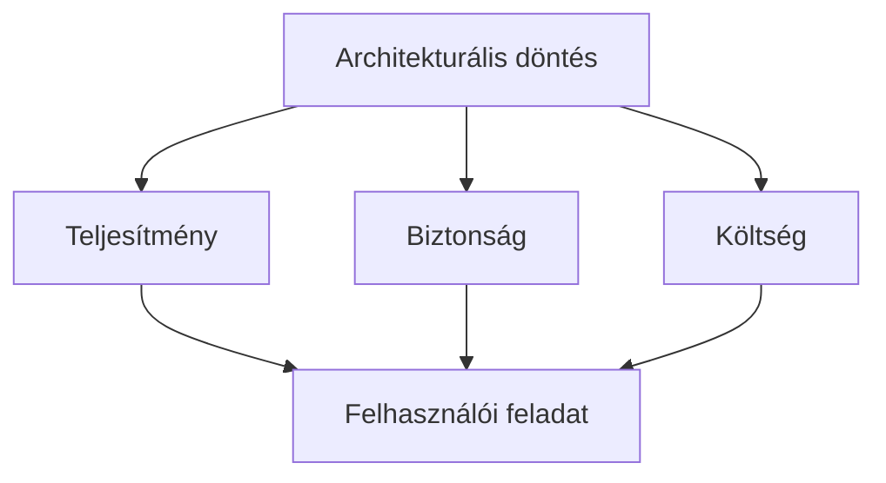

# Teljesítmény, biztonság és költség

A gyors, megbízható és biztonságos működéshez erőforrás kell, de nem minden gyorsítás vagy kapacitásnövelés éri meg. A jó döntés az adott szolgáltatás fontos feladatait, kockázatait és terhelését egyszerre veszi figyelembe.

## Három cél, egy rendszer

Képzeljünk el egy egyszerű online időpontfoglaló rendszert. A felhasználó megnyitja az oldalt, kiválaszt egy szolgáltatást, bejelentkezik, majd időpontot foglal. Első pillantásra könnyű kimondani, hogy az oldal legyen gyors, biztonságos és olcsó. A három szó azonban nem ugyanazt jelenti, és a gyakorlatban nem mindig erősítik egymást.

A **teljesítmény** a felhasználó szemszögéből többnyire azt jelenti, hogy az oldal gyorsan megjelenik, a gombnyomásra hamar reagál, és a fontos művelet – például a foglalás elküldése – nem késik bizonytalanul. Rendszerszinten ide tartozik az is, hogy sok egyidejű kérés mellett se romoljon elfogadhatatlanul a válaszidő. A gyorsaságot gyakran milliszekundumokban mérik, de a felhasználó nem milliszekundumokat érzékel: azt érzékeli, hogy „az oldal azonnal használható”, „várnom kell”, vagy „nem tudom, történt-e valami”.

A **biztonság** azt jelenti, hogy a rendszer a megfelelő személynek a megfelelő adatot és műveletet engedi meg, miközben ellenáll a hibáknak, támadásoknak és téves használatnak. Egy időpontfoglaló oldalon lehet kevésbé érzékeny adat is, de bejelentkezési adat, személyes elérhetőség és esetleg egészségügyi vagy fizetési információ is előfordulhat. Itt a „majd később javítjuk” hozzáállás komoly következményekkel járhat.

A **költség** nem csak a havi felhőszámlát jelenti. Ide tartozik a fejlesztők ideje, a rendszer bonyolultságának fenntartása, a monitorozás, a támogatás, az incidensek kezelése, a külső szolgáltatások díja és a hibák üzleti vagy társadalmi kára is. Egy olcsón elindított, de nehezen karbantartható szolgáltatás később drágább lehet, mint egy eleve átgondoltabb megoldás.

## Miért kell választani?

Nem minden döntés kényszerít valódi választásra. A felesleges képek tömörítése például gyakran gyorsítja az oldalt és közben költséget is csökkent, mert kevesebb adatot kell átvitelre és tárolásra fizetni. Sok helyzetben viszont az egyik cél javítása erőforrást kér a másiktól.

Vegyük a **bejelentkezést**. A felhasználó számára a jelszó beírása és egy második ellenőrző lépés kényelmetlenebb, mint az azonnali belépés. Mégis, többfaktoros hitelesítés esetén lényegesen nehezebb egy ellopott jelszóval fiókot feltörni. A biztonsági nyereségért itt némi súrlódást vállalunk. Ha pedig valaki a belépési próbálkozások számát korlátozza vagy emberi ellenőrzést kér, a brutális jelszópróbálgatás lassul, de egy valódi felhasználó is tapasztalhat várakozást.

Hasonló feszültség jelenik meg a **gyorsítótárazásnál**. Ha egy szerver egy korábban elkészített oldalt vagy API-választ ad vissza újraszámolás helyett, gyorsabb lesz és kevesebb számítási erőforrást használ. Ez kedvez a teljesítménynek és költségnek. Ám mi történik, ha a tárolt válasz egy másik felhasználó személyes adatait tartalmazza, vagy már elavult? Ilyenkor a rosszul beállított gyorsítótár adatvédelmi vagy üzleti hibát okozhat. A cache nem „bekapcsolandó gyorsítás”, hanem szabályokkal körülírt döntés: mit, kinek, mennyi ideig szabad újra felhasználni?

Az **adatok földrajzi elhelyezése** is ilyen kérdés. A felhasználókhoz közeli tartalomszolgáltató hálózat (CDN) rövidebb késleltetést adhat, és egy terhelési csúcsot is jobban elvisel. Ugyanakkor a szolgáltatás drágábbá, szerződésileg összetettebbé válhat; érzékeny adatoknál pedig meg kell érteni, melyik fél mit kezel, milyen régióban és milyen jogalappal. Nem az a kérdés, hogy a CDN „jó-e”, hanem hogy a szolgáltatás statikus nyilvános képeihez, videóihoz vagy szoftverfájljaihoz indokolt-e, és milyen adatot nem szabad általa kiszolgálni.

## Egy döntés négy nézőpontja

Hasznos, ha egy tervezési kérdésnél ugyanazt a négy kérdést tesszük fel.

1. **Mi a felhasználói hatás?** Mennyi várakozás vagy plusz lépés elfogadható? Kinek okoz különösen nagy kárt egy hiba?
2. **Mi a védendő érték és a fenyegetés?** Személyes adatról, pénzről, vizsgaeredményről, jogosultságról vagy nyilvános tartalomról van szó? Ki és hogyan élhet vissza vele?
3. **Mi a terhelési és üzemeltetési helyzet?** Állandó vagy időszakos forgalomra kell készülni? Van-e kiszámítható csúcs, például kurzusfelvétel vagy jegyértékesítés?
4. **Mennyibe kerül a teljes életciklus?** Nemcsak az indulás, hanem az ellenőrzés, javítás, megfigyelés és későbbi módosítás is.

Ez a gondolkodás segít elkerülni a hangzatos, de üres válaszokat: „tegyünk mindent felhőbe”, „legyen mikroszolgáltatás”, „titkosítsunk mindent” vagy „legyen nagyon gyors”. Ezeknek a mondatoknak csak akkor van értelmük, ha megmondjuk: pontosan mit, miért, milyen fenyegetés ellen, milyen felhasználói elvárással és milyen költséggel.

## Példa: terméklista és fizetés

Egy webáruház terméklistája jellemzően sok ember számára azonos vagy közel azonos információ: terméknév, kép, rövid leírás, kategória. Egy ilyen oldal elemei többnyire jól gyorsítótárazhatók, és CDN-en keresztül is kiszolgálhatók. A gyors betöltés csökkenti a szerverterhelést, ezért a teljesítmény és a költség célja akár együtt javulhat.

A fizetési folyamat viszont más természetű. Itt a felhasználóhoz kötött kosár, cím, fizetési állapot és megrendelés szerepel. Egy régi vagy rossz személyhez kötött válasz nagyon súlyos hiba lenne. Nem fogadható el például, hogy egy „rendelés sikeres” oldal kiszolgálása csupán egy korábban tárolt válaszból történjen. A fizetésnél fontosabb lehet az, hogy minden kérés érvényesítve, naplózhatóan és egyértelmű eredménnyel fusson le, még ha ez több adatbázis-műveletet és valamivel hosszabb válaszidőt jelent is.

A jó tervezés tehát nem a webáruház egészére választ egyetlen teljesítmény- vagy biztonsági szintet. Funkciónként különböztet: a nyilvános, ritkán változó tartalom agresszívebben gyorsítható; a személyes és visszafordíthatatlan műveletek szigorúbb ellenőrzést kapnak. A rendszerszintű gondolkodás egyik kulcsa a határok felismerése.

## Biztonság, amely nem csak lassítás

Gyakori félreértés, hogy a biztonság szükségszerűen „lassúvá teszi” a rendszert. Valóban van költsége: titkosított kapcsolat létrehozása, bemeneti adatok ellenőrzése, jogosultság megállapítása és naplózás mind munkát jelent. Ezek azonban sokszor elenyészőek ahhoz képest, amennyit egy adatvédelmi incidens, jogosulatlan tranzakció vagy helyreállítás felemészt.

Ráadásul a biztonságos kialakítás néha a teljesítményt is rendezi. A jól meghatározott jogosultsági határok és az adatminimalizálás például csökkenthetik, mennyi adatot kell egy válaszban elküldeni. A megfelelően méretezett sebességkorlátozás megvédheti a szolgáltatást a hibás vagy rosszindulatú forgalomtól, így a valódi felhasználók számára éppen javíthatja az elérhetőséget. A cél nem a védelem elhagyása a gyorsaság kedvéért, hanem a kockázathoz illő védelem.

## Költség: az olcsó nem mindig takarékos

Egy kis egyetemi projekt számára túlzás lehet a folyamatosan több régióban működő, automatikusan skálázódó infrastruktúra. Sok pénzbe, tanulásba és karbantartásba kerülne, miközben az oldalt naponta néhány tucat ember használja. Egy egyszerűbb, megbízhatóan mentett és megfigyelt szolgáltatás ilyenkor gyakran jobb döntés.

Fordított helyzetben, amikor egy vizsgajelentkezés pontos időpontban több ezer hallgatót vonz, az alulméretezett rendszer olcsósága csak látszólagos. A leállás ügyfélszolgálati terhelést, bizalomvesztést, méltányossági problémát és rendkívüli munkát eredményezhet. A költségbecslésnek ezért az elmaradt szolgáltatás árát is tartalmaznia kell.

Érdemes az **egyszerűség** értékére is gondolni. Minden új komponens – külön adatbázis, üzenetsor, cache-réteg, külső identitásszolgáltató – képes megoldani egy problémát, de új hibalehetőséget, függőséget és tudásigényt is hoz. Nem az a cél, hogy kevés technológia legyen, hanem hogy minden technológiának világos oka és gazdája legyen.

## Hogyan születik védhető döntés?

Egy rövid döntési jegyzet sokat érhet. Például: „A nyilvános eseménylista válaszait öt percig gyorsítótárazzuk, mert az adatok nem személyesek, ritkán változnak, és a regisztráció megnyitásakor várható csúcsforgalom. A foglalási és fiókoldalakat nem osztott gyorsítótárból szolgáljuk ki, mert személyes, gyorsan változó adatot tartalmaznak.” Ez a mondat megnevezi a döntést, a célt, a kockázatot és a határt.

> [!tip] Fordítsd a célokat mérhető követelményekre
> A döntéseket mérésnek kell követnie. A „gyors” önmagában nem mérhető cél. Inkább azt kérdezzük: a kulcsoldal a legtöbb felhasználónál mennyi idő alatt válik használhatóvá? Csúcsidőben mekkora a hibaarány? Hány sikertelen belépési kísérlet történik? Mennyibe kerül egy hónap átlagos és csúcsforgalma? A mérőszámok értelmezésekor az emberi következményeket is érdemes figyelni: egy hibaüzenet érthető-e, a lassulás mindenkit vagy csak bizonyos hálózaton lévőket érint-e?

## Gyakori félreértések

**„A leggyorsabb megoldás mindig a legjobb.”** Nem feltétlenül. A gyors, de hibás, rosszul védett vagy drága megoldás nem jó szolgáltatás. A fontos műveleteknél a helyes, igazolható eredmény többet érhet néhány tizedmásodpercnél.

**„A biztonság a biztonsági csapat feladata.”** Nem. A jogosultságok, adatátadás, felhasználói felület és alapértelmezések már a tervezési és fejlesztési döntésekben eldőlnek.

**„A felhő automatikusan megoldja a terhelést.”** A felhő adhat rugalmas kapacitást, de egy hibás adatbázis-lekérdezést, rossz cache-szabályt vagy végtelen újrapróbálkozást nem javít meg magától. A növekvő kapacitás ráadásul költséget termel.

**„A cache csak teljesítményoptimalizálás.”** A cache adatkezelési szabály. Lejárata, érvénytelenítése és megosztási köre befolyásolhatja a helyességet és az adatvédelmet is.

**„A kompromisszum azt jelenti, hogy valamelyik célról lemondunk.”** Nem feltétlenül. Gyakran azt jelenti, hogy a védelem vagy a teljesítmény a megfelelő helyre kerül, nem pedig mindenhol azonos erővel jelenik meg.
