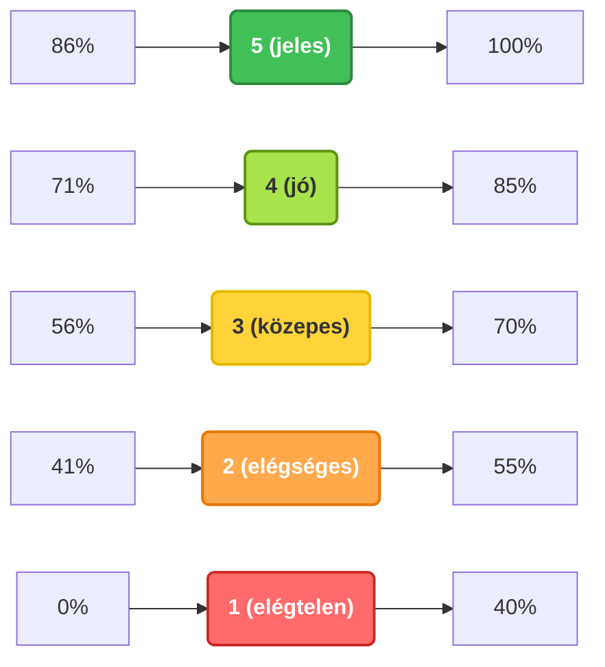

# Számonkérési és értékelési rendszer

A félév végi érdemjegy megszerzésének alapvető feltétele az órai jelenlét, valamint a félév végi zárthelyi dolgozat (ZH) megírása.

#### 1. Jelenléti követelmények

A kontaktórák legalább 70%-án kötelező a részvétel. A félév során meghirdetett konzultációs órákon való részvétel ajánlott, de nem kötelező.

#### 2. Zárthelyi dolgozat (ZH)

A szorgalmi időszak végén egy zárthelyi dolgozat megírása kötelező.

- **A ZH időpontja:** A szorgalmi időszak utolsó előtti hete.
- **Pót-ZH időpontja:** A szorgalmi időszak utolsó hete.

**Hiányzás és pótlás:** Amennyiben a hallgató sem a normál ZH-n, sem a pót-ZH-n nem tud megjelenni, egy harmadik pótlási időpontra kizárólag abban az esetben kaphat lehetőséget, ha **mindkét időpontra (a normál és a pót-ZH-ra is) kiterjedő orvosi igazolást** mutat be.

A tantárgy teljesítése automatikusan sikertelen (elégtelen), ha a hallgató a dolgozatot (vagy jogosultság esetén a pót-ZH-t) nem írja meg, vagy annak eredménye elégtelen (1).

#### 3. Az érdemjegy megállapítása és a vizsga

Az érdemjegy megállapítása legalább elégséges (2) ZH esetén a következőképpen történik:

- **Megajánlott jegy:** Alapesetben, amennyiben a zárthelyi dolgozat eredménye jó (4) vagy jeles (5), a hallgató ezt a jegyet kaphatja megajánlott félév végi érdemjegyként. **Fontos kiemelni, hogy a megajánlott jegy megadása minden esetben oktatói döntéskörbe tartozik.** A döntés során az oktató a ZH eredményén felül figyelembe veszi a hallgató egész féléves órai aktivitását is.
- **Szóbeli vizsga:** Amennyiben a zárthelyi dolgozat eredménye elégséges (2) vagy közepes (3) – illetve ha a hallgató nem kap megajánlott jegyet –, a vizsgaidőszakban szóbeli vizsgát kell tennie. A szóbeli vizsga nem előre kiadott tételsor alapján történik: a teljes féléves tananyag átfogó ismeretét kéri számon.

#### 4. Értékelési skála (ZH és vizsga esetén egyaránt)

A százalékos teljesítmények érdemjegyre történő átszámítása az alábbi ponthatárok alapján történik:

| Érdemjegy         | Teljesítmény |
| ----------------- | ------------ |
| **Jeles (5)**     | 86% – 100%   |
| **Jó (4)**        | 71% – 85%    |
| **Közepes (3)**   | 56% – 70%    |
| **Elégséges (2)** | 41% – 55%    |
| **Elégtelen (1)** | 0% – 40%     |

